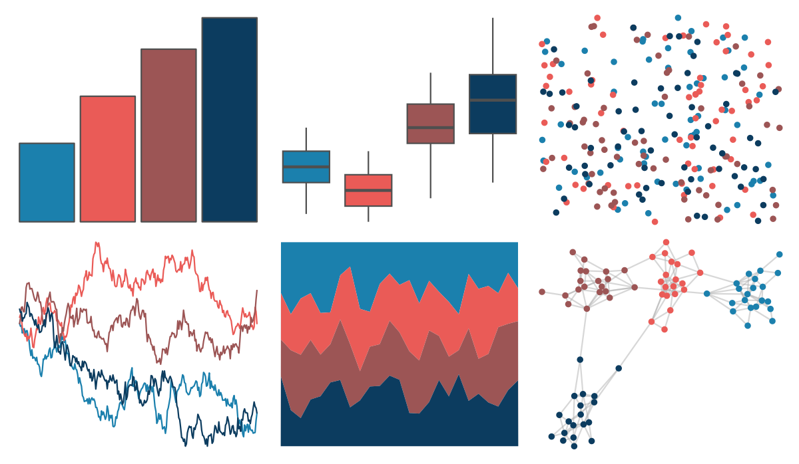

# MoMAColors - Palermo 

::: columns
::: {.column width="50%"}

**Github**

[BlakeRMills/MoMAColors](https://github.com/BlakeRMills/MoMAColors)
:::

::: {.column width="50%"}

**CRAN**

Not on CRAN
:::
:::

<hr> 

Use with [paletteer](https://emilhvitfeldt.github.io/paletteer/) package:

```r
library(paletteer)
paletteer_d("MoMAColors::Palermo")
```

Use raw:

```r
c("#1B80ADFF", "#EA5B57FF", "#9C5555FF", "#0C3C5FFF")
``` 

 

<br>

# Related Palettes

<div class="list" style="display: grid; grid-template-columns: auto auto auto;"> <figure class="figure">
<a href="../../awtools/a_palette/"> </a>
</figure> <figure class="figure">
<a href="../../ButterflyColors/hamadryas_feronia/"> </a>
</figure> <figure class="figure">
<a href="../../ButterflyColors/hamadryas_feronia/"> </a>
</figure> <figure class="figure">
<a href="../../MetBrewer/Troy/"> </a>
</figure> <figure class="figure">
<a href="../../lisa/Masaccio/"> </a>
</figure> <figure class="figure">
<a href="../../MoMAColors/Picasso/"> </a>
</figure> <figure class="figure">
<a href="../../nbapalettes/kings_city/"> </a>
</figure> <figure class="figure">
<a href="../../nbapalettes/rockets_90s/"> </a>
</figure> <figure class="figure">
<a href="../../MapPalettes/bruiser/"> </a>
</figure> <figure class="figure">
<a href="../../colRoz/m_horridus/"> </a>
</figure> <figure class="figure">
<a href="../../nbapalettes/bobcats/"> </a>
</figure> <figure class="figure">
<a href="../../beyonce/X1/"> </a>
</figure> 
</div>
