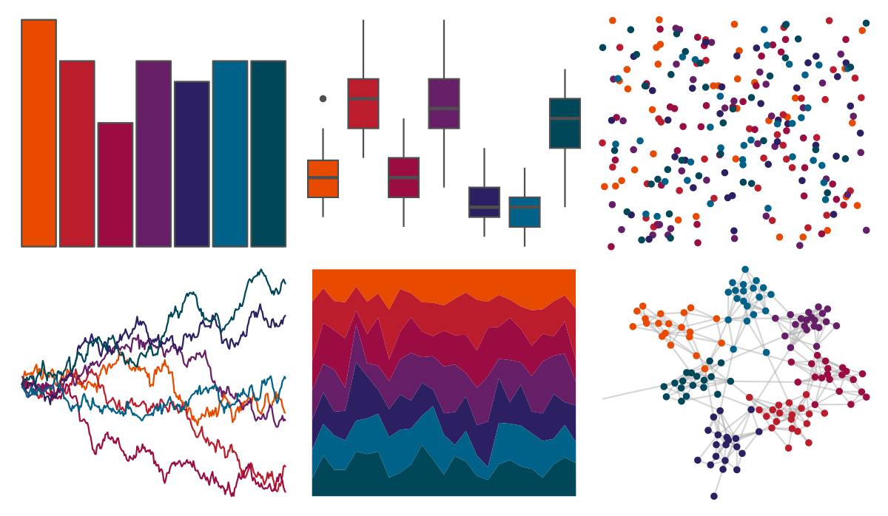

# MoMAColors - Panton 

::: columns
::: {.column width="50%"}

**Github**

[BlakeRMills/MoMAColors](https://github.com/BlakeRMills/MoMAColors)
:::

::: {.column width="50%"}

**CRAN**

Not on CRAN
:::
:::

<hr> 

Use with [paletteer](https://emilhvitfeldt.github.io/paletteer/) package:

```r
library(paletteer)
paletteer_d("MoMAColors::Panton")
```

Use raw:

```r
c("#E84A00FF", "#BB1D2CFF", "#9B0C43FF", "#661F66FF", "#2C1F62FF", "#006289FF", "#004759FF")
``` 

 

<br>

# Related Palettes

<div class="list" style="display: grid; grid-template-columns: auto auto auto;"> <figure class="figure">
<a href="../../awtools/a_palette/"> </a>
</figure> <figure class="figure">
<a href="../../ButterflyColors/hamadryas_feronia/"> </a>
</figure> <figure class="figure">
<a href="../../ButterflyColors/hamadryas_feronia/"> </a>
</figure> <figure class="figure">
<a href="../../lisa/PaulKlee_1/"> </a>
</figure> <figure class="figure">
<a href="../../MoMAColors/Palermo/"> </a>
</figure> <figure class="figure">
<a href="../../ggsci/hallmarks_dark_cosmic/"> </a>
</figure> <figure class="figure">
<a href="../../MetBrewer/Troy/"> </a>
</figure> <figure class="figure">
<a href="../../beyonce/X14/"> </a>
</figure> <figure class="figure">
<a href="../../NineteenEightyR/cobra/"> </a>
</figure> <figure class="figure">
<a href="../../fishualize/Clepticus_parrae/"> </a>
</figure> <figure class="figure">
<a href="../../nord/victory_bonds/"> </a>
</figure> <figure class="figure">
<a href="../../peRReo/ivyqueen/"> </a>
</figure> 
</div>
