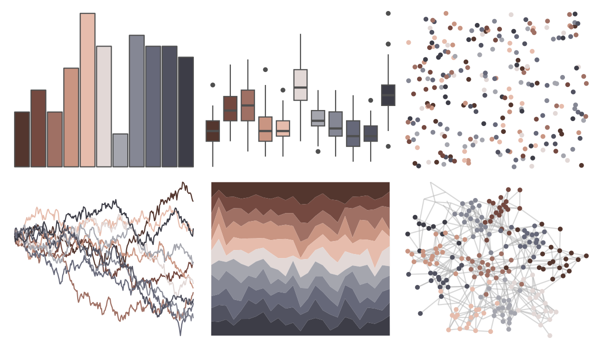
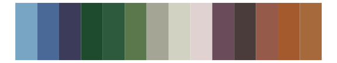

# MoMAColors - Picabia 

::: columns
::: {.column width="50%"}

**Github**

[BlakeRMills/MoMAColors](https://github.com/BlakeRMills/MoMAColors)
:::

::: {.column width="50%"}

**CRAN**

Not on CRAN
:::
:::

<hr> 

Use with [paletteer](https://emilhvitfeldt.github.io/paletteer/) package:

```r
library(paletteer)
paletteer_d("MoMAColors::Picabia")
```

Use raw:

```r
c("#53362EFF", "#744940FF", "#9F7064FF", "#C99582FF", "#E6BCACFF", "#E2D8D6FF", "#A5A6AEFF", "#858794FF", "#666879FF", "#515260FF", "#3D3D47FF")
``` 

 

<br>

# Related Palettes

<div class="list" style="display: grid; grid-template-columns: auto auto auto;"> <figure class="figure">
<a href="../../amerika/Dem_Ind_Rep3/"> </a>
</figure> <figure class="figure">
<a href="../../impressionist.colors/la_chanson_du_chien/"> </a>
</figure> <figure class="figure">
<a href="../../nord/halifax_harbor/"> </a>
</figure> <figure class="figure">
<a href="../../MexBrewer/Alacena/"> </a>
</figure> <figure class="figure">
<a href="../../Manu/Kiwi/"> </a>
</figure> <figure class="figure">
<a href="../../impressionist.colors/fleurs_dans_un_vase_de_cristal/"> </a>
</figure> <figure class="figure">
<a href="../../peRReo/wyy/"> </a>
</figure> <figure class="figure">
<a href="../../ochRe/parliament/"> </a>
</figure> <figure class="figure">
<a href="../../ggsci/brown_material/"> </a>
</figure> <figure class="figure">
<a href="../../impressionist.colors/les_peupliers/"> </a>
</figure> <figure class="figure">
<a href="../../tayloRswift/taylor1989/"> </a>
</figure> <figure class="figure">
<a href="../../beyonce/X60/"> </a>
</figure> 
</div>
