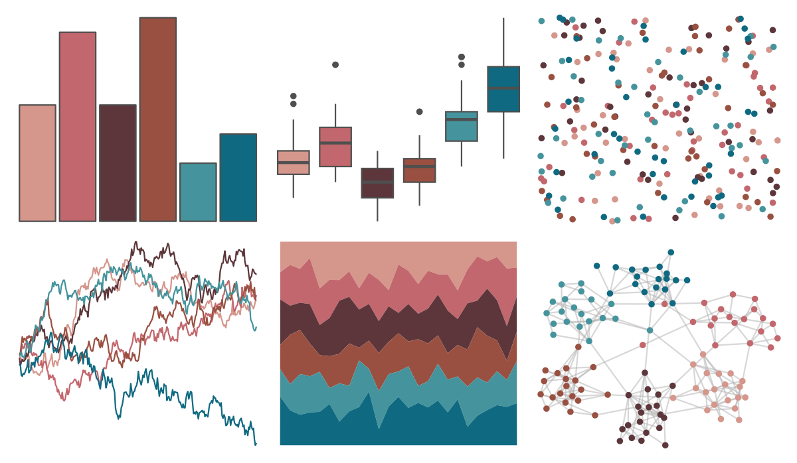

# MoMAColors - Picasso 

::: columns
::: {.column width="50%"}

**Github**

[BlakeRMills/MoMAColors](https://github.com/BlakeRMills/MoMAColors)
:::

::: {.column width="50%"}

**CRAN**

Not on CRAN
:::
:::

<hr> 

Use with [paletteer](https://emilhvitfeldt.github.io/paletteer/) package:

```r
library(paletteer)
paletteer_d("MoMAColors::Picasso")
```

Use raw:

```r
c("#D5968CFF", "#C2676DFF", "#5C363AFF", "#995041FF", "#45939CFF", "#0F6A81FF")
``` 

 

<br>

# Related Palettes

<div class="list" style="display: grid; grid-template-columns: auto auto auto;"> <figure class="figure">
<a href="../../awtools/a_palette/"> </a>
</figure> <figure class="figure">
<a href="../../ButterflyColors/hamadryas_feronia/"> </a>
</figure> <figure class="figure">
<a href="../../ButterflyColors/hamadryas_feronia/"> </a>
</figure> <figure class="figure">
<a href="../../ggthemr/sky/"> </a>
</figure> <figure class="figure">
<a href="../../beyonce/X1/"> </a>
</figure> <figure class="figure">
<a href="../../werpals/when_i_was_your_age/"> </a>
</figure> <figure class="figure">
<a href="../../Manu/Putangitangi/"> </a>
</figure> <figure class="figure">
<a href="../../ButterflyColors/parides_zacynthus_polymetus/"> </a>
</figure> <figure class="figure">
<a href="../../yarrr/usualsuspects/"> </a>
</figure> <figure class="figure">
<a href="../../fishualize/Oncorhynchus_kisutch/"> </a>
</figure> <figure class="figure">
<a href="../../suffrager/oxon/"> </a>
</figure> <figure class="figure">
<a href="../../calecopal/superbloom3/"> </a>
</figure> 
</div>
