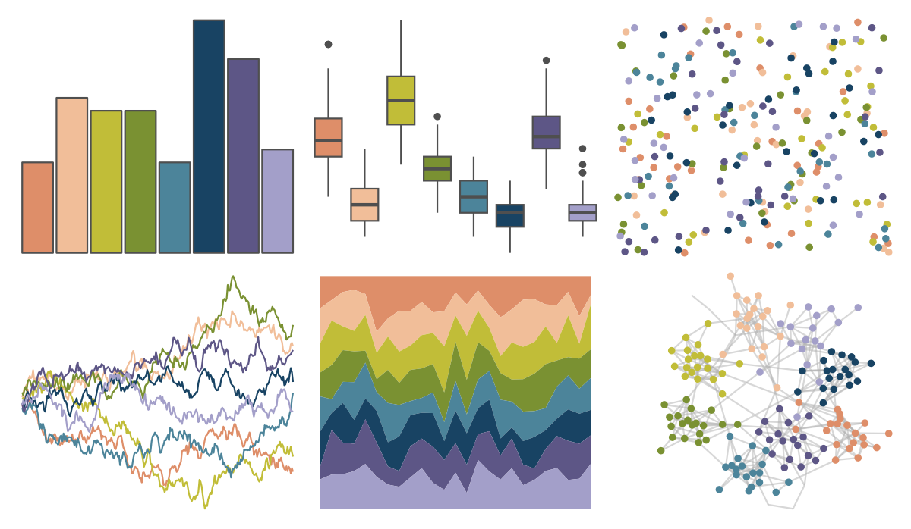

# MoMAColors - Rattner 

::: columns
::: {.column width="50%"}

**Github**

[BlakeRMills/MoMAColors](https://github.com/BlakeRMills/MoMAColors)
:::

::: {.column width="50%"}

**CRAN**

Not on CRAN
:::
:::

<hr> 

Use with [paletteer](https://emilhvitfeldt.github.io/paletteer/) package:

```r
library(paletteer)
paletteer_d("MoMAColors::Rattner")
```

Use raw:

```r
c("#DE8E69FF", "#F1BE99FF", "#C1BD38FF", "#7A9132FF", "#4C849AFF", "#184363FF", "#5D5686FF", "#A39FC9FF")
``` 

 

<br>

# Related Palettes

<div class="list" style="display: grid; grid-template-columns: auto auto auto;"> <figure class="figure">
<a href="../../awtools/a_palette/"> </a>
</figure> <figure class="figure">
<a href="../../ButterflyColors/hamadryas_feronia/"> </a>
</figure> <figure class="figure">
<a href="../../ButterflyColors/hamadryas_feronia/"> </a>
</figure> <figure class="figure">
<a href="../../IslamicArt/alhambra/"> </a>
</figure> <figure class="figure">
<a href="../../Manu/Kotare/"> </a>
</figure> <figure class="figure">
<a href="../../lisa/VincentvanGogh_2/"> </a>
</figure> <figure class="figure">
<a href="../../impressionist.colors/la_recolte_des_foins_eragny/"> </a>
</figure> <figure class="figure">
<a href="../../MetBrewer/Tiepolo/"> </a>
</figure> <figure class="figure">
<a href="../../lisa/JamesJean/"> </a>
</figure> <figure class="figure">
<a href="../../ghibli/PonyoMedium/"> </a>
</figure> <figure class="figure">
<a href="../../ltc/crbhits/"> </a>
</figure> <figure class="figure">
<a href="../../lisa/JoanMiro/"> </a>
</figure> 
</div>
