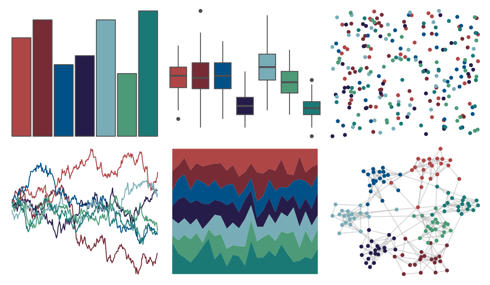

# MoMAColors - Sidhu 

::: columns
::: {.column width="50%"}

**Github**

[BlakeRMills/MoMAColors](https://github.com/BlakeRMills/MoMAColors)
:::

::: {.column width="50%"}

**CRAN**

Not on CRAN
:::
:::

<hr> 

Use with [paletteer](https://emilhvitfeldt.github.io/paletteer/) package:

```r
library(paletteer)
paletteer_d("MoMAColors::Sidhu")
```

Use raw:

```r
c("#AF4646FF", "#762B35FF", "#005187FF", "#251C4AFF", "#78ADB7FF", "#4C9A77FF", "#1B7975FF")
``` 

 

<br>

# Related Palettes

<div class="list" style="display: grid; grid-template-columns: auto auto auto;"> <figure class="figure">
<a href="../../awtools/a_palette/"> </a>
</figure> <figure class="figure">
<a href="../../ButterflyColors/hamadryas_feronia/"> </a>
</figure> <figure class="figure">
<a href="../../ButterflyColors/hamadryas_feronia/"> </a>
</figure> <figure class="figure">
<a href="../../ggthemr/solarized/"> </a>
</figure> <figure class="figure">
<a href="../../nbapalettes/pistons_city/"> </a>
</figure> <figure class="figure">
<a href="../../nbapalettes/timberwolves_statement/"> </a>
</figure> <figure class="figure">
<a href="../../nbapalettes/pistons/"> </a>
</figure> <figure class="figure">
<a href="../../nbapalettes/rockets_90s/"> </a>
</figure> <figure class="figure">
<a href="../../severance/TheYouYouAre/"> </a>
</figure> <figure class="figure">
<a href="../../MetBrewer/Troy/"> </a>
</figure> <figure class="figure">
<a href="../../ghibli/KikiMedium/"> </a>
</figure> <figure class="figure">
<a href="../../nbapalettes/hornets2/"> </a>
</figure> 
</div>
