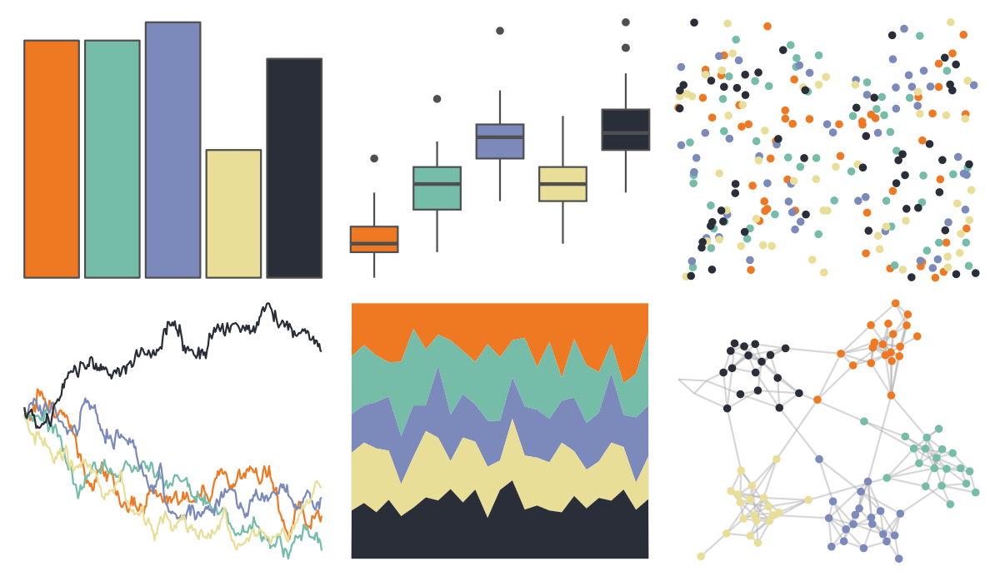

# MoMAColors - Smith 

::: columns
::: {.column width="50%"}

**Github**

[BlakeRMills/MoMAColors](https://github.com/BlakeRMills/MoMAColors)
:::

::: {.column width="50%"}

**CRAN**

Not on CRAN
:::
:::

<hr> 

Use with [paletteer](https://emilhvitfeldt.github.io/paletteer/) package:

```r
library(paletteer)
paletteer_d("MoMAColors::Smith")
```

Use raw:

```r
c("#EF7923FF", "#75BCA9FF", "#7B89BBFF", "#E9DE97FF", "#2A2E38FF")
``` 

 

<br>

# Related Palettes

<div class="list" style="display: grid; grid-template-columns: auto auto auto;"> <figure class="figure">
<a href="../../amerika/Dem_Ind_Rep3/"> </a>
</figure> <figure class="figure">
<a href="../../Redmonder/qMSO12/"> </a>
</figure> <figure class="figure">
<a href="../../feathers/rose_crowned_fruit_dove/"> </a>
</figure> <figure class="figure">
<a href="../../fishualize/Halichoeres_radiatus/"> </a>
</figure> <figure class="figure">
<a href="../../fishualize/Pseudocheilinus_tetrataenia/"> </a>
</figure> <figure class="figure">
<a href="../../MexBrewer/Casita1/"> </a>
</figure> <figure class="figure">
<a href="../../ggthemes/excel_Headlines/"> </a>
</figure> <figure class="figure">
<a href="../../peRReo/calle13/"> </a>
</figure> <figure class="figure">
<a href="../../nationalparkcolors/BlueRidgePkwy/"> </a>
</figure> <figure class="figure">
<a href="../../IslamicArt/alhambra/"> </a>
</figure> <figure class="figure">
<a href="../../lisa/MarcChagall/"> </a>
</figure> <figure class="figure">
<a href="../../calecopal/superbloom1/"> </a>
</figure> 
</div>
