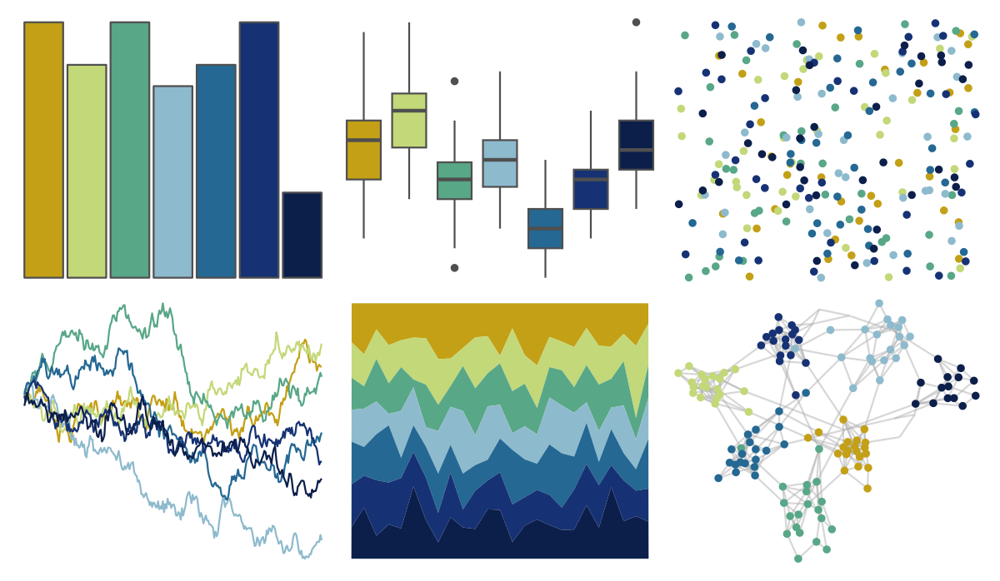

# MoMAColors - VanGogh 

::: columns
::: {.column width="50%"}

**Github**

[BlakeRMills/MoMAColors](https://github.com/BlakeRMills/MoMAColors)
:::

::: {.column width="50%"}

**CRAN**

Not on CRAN
:::
:::

<hr> 

Use with [paletteer](https://emilhvitfeldt.github.io/paletteer/) package:

```r
library(paletteer)
paletteer_d("MoMAColors::VanGogh")
```

Use raw:

```r
c("#C3A016FF", "#C3D878FF", "#58A787FF", "#8EBACDFF", "#246893FF", "#163274FF", "#0C1F4BFF")
``` 

 

<br>

# Related Palettes

<div class="list" style="display: grid; grid-template-columns: auto auto auto;"> <figure class="figure">
<a href="../../amerika/Dem_Ind_Rep3/"> </a>
</figure> <figure class="figure">
<a href="../../ghibli/YesterdayMedium/"> </a>
</figure> <figure class="figure">
<a href="../../MoMAColors/Ernst/"> </a>
</figure> <figure class="figure">
<a href="../../MetBrewer/Hokusai3/"> </a>
</figure> <figure class="figure">
<a href="../../lisa/VincentvanGogh/"> </a>
</figure> <figure class="figure">
<a href="../../vangogh/StarryRhone/"> </a>
</figure> <figure class="figure">
<a href="../../poisonfrogs/Rvariabilis/"> </a>
</figure> <figure class="figure">
<a href="../../ButterflyColors/heliconius_sara_apseudes/"> </a>
</figure> <figure class="figure">
<a href="../../nbapalettes/hornets_believe/"> </a>
</figure> <figure class="figure">
<a href="../../beyonce/X19/"> </a>
</figure> <figure class="figure">
<a href="../../fishualize/Rhinecanthus_aculeatus/"> </a>
</figure> <figure class="figure">
<a href="../../blueycolors/bluey/"> </a>
</figure> 
</div>
