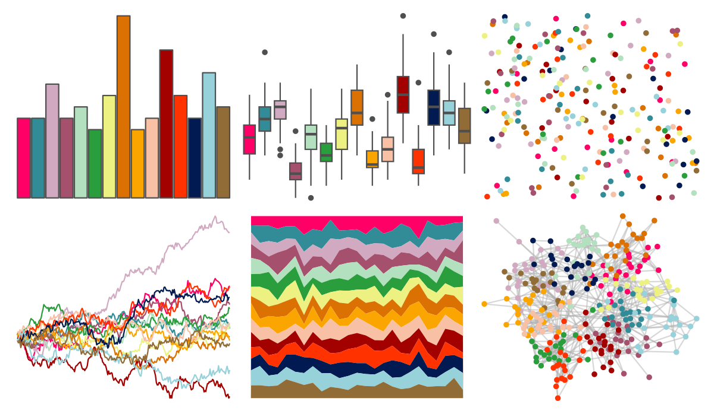

# MoMAColors - Warhol 

::: columns
::: {.column width="50%"}

**Github**

[BlakeRMills/MoMAColors](https://github.com/BlakeRMills/MoMAColors)
:::

::: {.column width="50%"}

**CRAN**

Not on CRAN
:::
:::

<hr> 

Use with [paletteer](https://emilhvitfeldt.github.io/paletteer/) package:

```r
library(paletteer)
paletteer_d("MoMAColors::Warhol")
```

Use raw:

```r
c("#FF0066FF", "#328C97FF", "#D1AAC2FF", "#A5506DFF", "#B3E0BFFF", "#2A9D3DFF", "#EDF181FF", "#DB7003FF", "#FBA600FF", "#F8C1A6FF", "#A30000FF", "#FF3200FF", "#011A51FF", "#97D1D9FF", "#916C37FF")
``` 

 

<br>

# Related Palettes

<div class="list" style="display: grid; grid-template-columns: auto auto auto;"> <figure class="figure">
<a href="../../amerika/Dem_Ind_Rep3/"> </a>
</figure> <figure class="figure">
<a href="../../ggsci/springfield_simpsons/"> </a>
</figure> <figure class="figure">
<a href="../../MoMAColors/Klein/"> </a>
</figure> <figure class="figure">
<a href="../../IslamicArt/shiraz/"> </a>
</figure> <figure class="figure">
<a href="../../palettetown/ledian/"> </a>
</figure> <figure class="figure">
<a href="../../palettetown/cyndaquil/"> </a>
</figure> <figure class="figure">
<a href="../../peRReo/calle13/"> </a>
</figure> <figure class="figure">
<a href="../../palettetown/quilava/"> </a>
</figure> <figure class="figure">
<a href="../../werpals/benagil/"> </a>
</figure> <figure class="figure">
<a href="../../palettetown/masquerain/"> </a>
</figure> <figure class="figure">
<a href="../../palettetown/typhlosion/"> </a>
</figure> <figure class="figure">
<a href="../../tidyquant/tq_green/"> </a>
</figure> 
</div>
