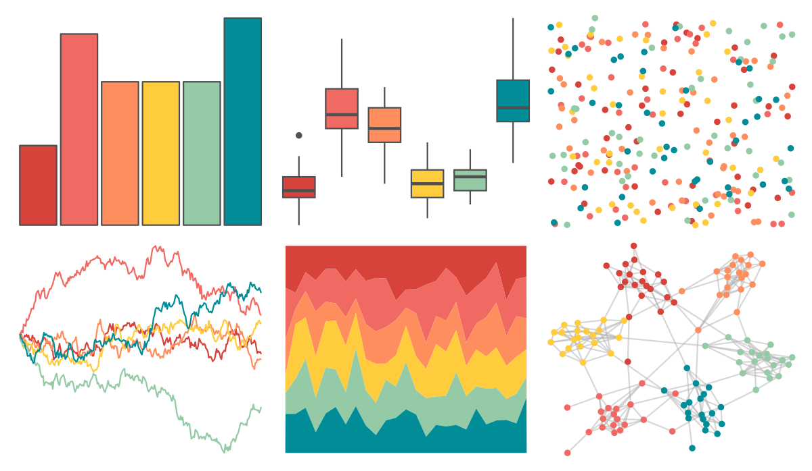

# MoMAColors - ustwo 

::: columns
::: {.column width="50%"}

**Github**

[BlakeRMills/MoMAColors](https://github.com/BlakeRMills/MoMAColors)
:::

::: {.column width="50%"}

**CRAN**

Not on CRAN
:::
:::

<hr> 

Use with [paletteer](https://emilhvitfeldt.github.io/paletteer/) package:

```r
library(paletteer)
paletteer_d("MoMAColors::ustwo")
```

Use raw:

```r
c("#D7433BFF", "#F06A63FF", "#FF8E5EFF", "#FFCC3DFF", "#95CAA6FF", "#008D98FF")
``` 

 

<br>

# Related Palettes

<div class="list" style="display: grid; grid-template-columns: auto auto auto;"> <figure class="figure">
<a href="../../awtools/a_palette/"> </a>
</figure> <figure class="figure">
<a href="../../ButterflyColors/hamadryas_feronia/"> </a>
</figure> <figure class="figure">
<a href="../../ButterflyColors/hamadryas_feronia/"> </a>
</figure> <figure class="figure">
<a href="../../DresdenColor/skingame/"> </a>
</figure> <figure class="figure">
<a href="../../waRhol/basquiat_85/"> </a>
</figure> <figure class="figure">
<a href="../../PrettyCols/Lucent/"> </a>
</figure> <figure class="figure">
<a href="../../ggthemes/Summer/"> </a>
</figure> <figure class="figure">
<a href="../../tvthemes/AirNomads/"> </a>
</figure> <figure class="figure">
<a href="../../rcartocolor/Geyser/"> </a>
</figure> <figure class="figure">
<a href="../../wesanderson/Zissou1/"> </a>
</figure> <figure class="figure">
<a href="../../fishualize/Phractocephalus_hemioliopterus/"> </a>
</figure> <figure class="figure">
<a href="../../MoMAColors/Connors/"> </a>
</figure> 
</div>
