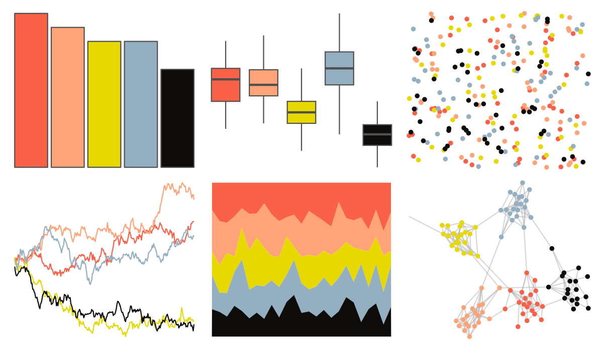

# MoMAColors - vonHeyl 

::: columns
::: {.column width="50%"}

**Github**

[BlakeRMills/MoMAColors](https://github.com/BlakeRMills/MoMAColors)
:::

::: {.column width="50%"}

**CRAN**

Not on CRAN
:::
:::

<hr> 

Use with [paletteer](https://emilhvitfeldt.github.io/paletteer/) package:

```r
library(paletteer)
paletteer_d("MoMAColors::vonHeyl")
```

Use raw:

```r
c("#F96149FF", "#FFA479FF", "#E7D800FF", "#94AEC2FF", "#0D0C0BFF")
``` 

 

<br>

# Related Palettes

<div class="list" style="display: grid; grid-template-columns: auto auto auto;"> <figure class="figure">
<a href="../../awtools/a_palette/"> </a>
</figure> <figure class="figure">
<a href="../../ButterflyColors/hamadryas_feronia/"> </a>
</figure> <figure class="figure">
<a href="../../ButterflyColors/hamadryas_feronia/"> </a>
</figure> <figure class="figure">
<a href="../../feathers/spotted_pardalote/"> </a>
</figure> <figure class="figure">
<a href="../../nationalparkcolors/Saguaro/"> </a>
</figure> <figure class="figure">
<a href="../../fishualize/Pseudocheilinus_tetrataenia/"> </a>
</figure> <figure class="figure">
<a href="../../fishualize/Salvelinus_fontinalis/"> </a>
</figure> <figure class="figure">
<a href="../../calecopal/fire/"> </a>
</figure> <figure class="figure">
<a href="../../DresdenColor/stormfront/"> </a>
</figure> <figure class="figure">
<a href="../../palettetown/teamrocket/"> </a>
</figure> <figure class="figure">
<a href="../../fishualize/Pterois_volitans/"> </a>
</figure> <figure class="figure">
<a href="../../tvthemes/CrazyLaceAgate/"> </a>
</figure> 
</div>
