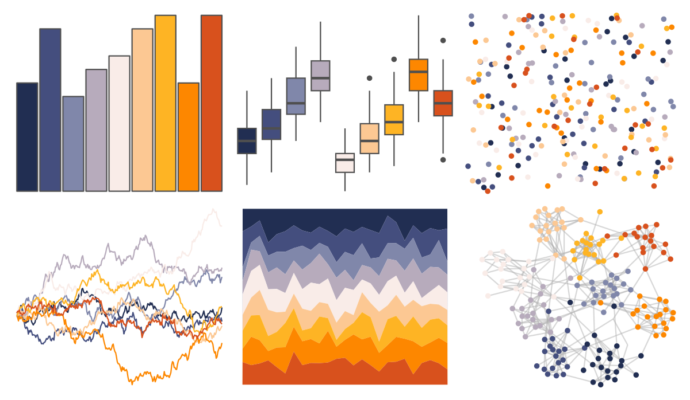

# NatParksPalettes - Acadia 

::: columns
::: {.column width="50%"}

**Github**

[kevinsblake/NatParksPalettes](https://github.com/kevinsblake/NatParksPalettes)
:::

::: {.column width="50%"}

**CRAN**

[NatParksPalettes](https://CRAN.R-project.org/package=NatParksPalettes)
:::
:::

<hr> 

Use with [paletteer](https://emilhvitfeldt.github.io/paletteer/) package:

```r
library(paletteer)
paletteer_d("NatParksPalettes::Acadia")
```

Use raw:

```r
c("#212E52FF", "#444E7EFF", "#8087AAFF", "#B7ABBCFF", "#F9ECE8FF", "#FCC893FF", "#FEB424FF", "#FD8700FF", "#D8511DFF")
``` 

 

<br>

# Related Palettes

<div class="list" style="display: grid; grid-template-columns: auto auto auto;"> <figure class="figure">
<a href="../../awtools/a_palette/"> </a>
</figure> <figure class="figure">
<a href="../../RColorBrewer/PuOr/"> </a>
</figure> <figure class="figure">
<a href="../../palettetown/totodile/"> </a>
</figure> <figure class="figure">
<a href="../../PNWColors/Sunset/"> </a>
</figure> <figure class="figure">
<a href="../../MetBrewer/OKeeffe1/"> </a>
</figure> <figure class="figure">
<a href="../../colRoz/uluru/"> </a>
</figure> <figure class="figure">
<a href="../../futurevisions/grand_tour/"> </a>
</figure> <figure class="figure">
<a href="../../futurevisions/cancri/"> </a>
</figure> <figure class="figure">
<a href="../../palettetown/ekans/"> </a>
</figure> <figure class="figure">
<a href="../../palettetown/gloom/"> </a>
</figure> <figure class="figure">
<a href="../../palettetown/phanpy/"> </a>
</figure> <figure class="figure">
<a href="../../ghibli/PonyoMedium/"> </a>
</figure> 
</div>
