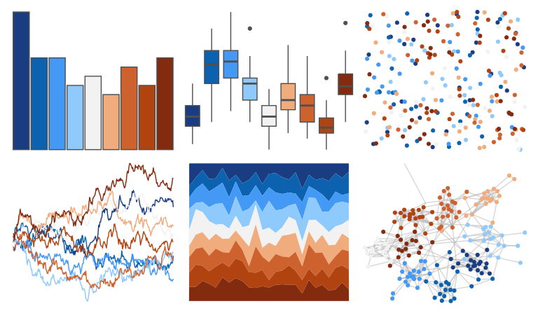

# NatParksPalettes - Arches 

::: columns
::: {.column width="50%"}

**Github**

[kevinsblake/NatParksPalettes](https://github.com/kevinsblake/NatParksPalettes)
:::

::: {.column width="50%"}

**CRAN**

[NatParksPalettes](https://CRAN.R-project.org/package=NatParksPalettes)
:::
:::

<hr> 

Use with [paletteer](https://emilhvitfeldt.github.io/paletteer/) package:

```r
library(paletteer)
paletteer_d("NatParksPalettes::Arches")
```

Use raw:

```r
c("#1A3D82FF", "#0C62AFFF", "#4499F5FF", "#8FCAFDFF", "#F2F2F2FF", "#F0AC7DFF", "#CD622EFF", "#B14311FF", "#832B0FFF")
``` 

 

<br>

# Related Palettes

<div class="list" style="display: grid; grid-template-columns: auto auto auto;"> <figure class="figure">
<a href="../../awtools/a_palette/"> </a>
</figure> <figure class="figure">
<a href="../../palettetown/phanpy/"> </a>
</figure> <figure class="figure">
<a href="../../MetBrewer/OKeeffe1/"> </a>
</figure> <figure class="figure">
<a href="../../RColorBrewer/RdBu/"> </a>
</figure> <figure class="figure">
<a href="../../palettetown/totodile/"> </a>
</figure> <figure class="figure">
<a href="../../khroma/BuRd/"> </a>
</figure> <figure class="figure">
<a href="../../palettetown/marill/"> </a>
</figure> <figure class="figure">
<a href="../../MetBrewer/Nizami/"> </a>
</figure> <figure class="figure">
<a href="../../NatParksPalettes/Acadia/"> </a>
</figure> <figure class="figure">
<a href="../../palettetown/tangela/"> </a>
</figure> <figure class="figure">
<a href="../../palettetown/flaaffy/"> </a>
</figure> <figure class="figure">
<a href="../../palettetown/nidoranf/"> </a>
</figure> 
</div>
