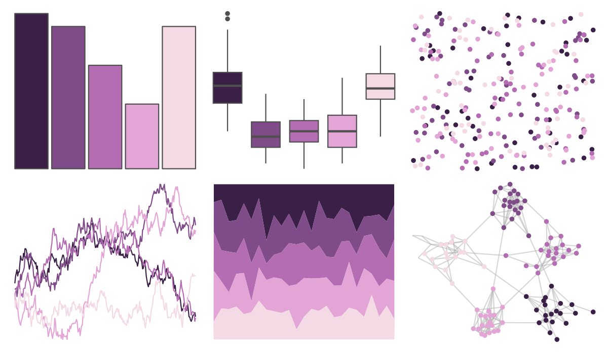

# NatParksPalettes - Arches2 

::: columns
::: {.column width="50%"}

**Github**

[kevinsblake/NatParksPalettes](https://github.com/kevinsblake/NatParksPalettes)
:::

::: {.column width="50%"}

**CRAN**

[NatParksPalettes](https://CRAN.R-project.org/package=NatParksPalettes)
:::
:::

<hr> 

Use with [paletteer](https://emilhvitfeldt.github.io/paletteer/) package:

```r
library(paletteer)
paletteer_d("NatParksPalettes::Arches2")
```

Use raw:

```r
c("#3A1F46FF", "#7F4B89FF", "#B46DB3FF", "#E3A5D6FF", "#F3DAE4FF")
``` 

 

<br>

# Related Palettes

<div class="list" style="display: grid; grid-template-columns: auto auto auto;"> <figure class="figure">
<a href="../../awtools/a_palette/"> </a>
</figure> <figure class="figure">
<a href="../../rcartocolor/Magenta/"> </a>
</figure> <figure class="figure">
<a href="../../tvthemes/Rhodonite/"> </a>
</figure> <figure class="figure">
<a href="../../rcartocolor/PurpOr/"> </a>
</figure> <figure class="figure">
<a href="../../nord/lumina/"> </a>
</figure> <figure class="figure">
<a href="../../rockthemes/muse/"> </a>
</figure> <figure class="figure">
<a href="../../beyonce/X27/"> </a>
</figure> <figure class="figure">
<a href="../../beyonce/X41/"> </a>
</figure> <figure class="figure">
<a href="../../ggsci/purple_material/"> </a>
</figure> <figure class="figure">
<a href="../../PNWColors/Starfish/"> </a>
</figure> <figure class="figure">
<a href="../../palettetown/ditto/"> </a>
</figure> <figure class="figure">
<a href="../../Redmonder/qMSOPu2/"> </a>
</figure> 
</div>
