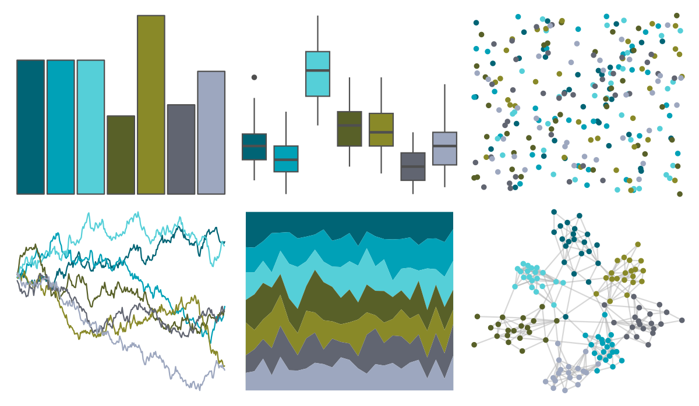
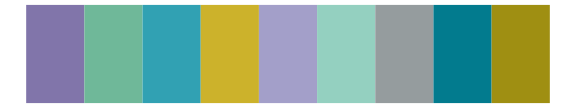

# NatParksPalettes - Banff 

::: columns
::: {.column width="50%"}

**Github**

[kevinsblake/NatParksPalettes](https://github.com/kevinsblake/NatParksPalettes)
:::

::: {.column width="50%"}

**CRAN**

[NatParksPalettes](https://CRAN.R-project.org/package=NatParksPalettes)
:::
:::

<hr> 

Use with [paletteer](https://emilhvitfeldt.github.io/paletteer/) package:

```r
library(paletteer)
paletteer_d("NatParksPalettes::Banff")
```

Use raw:

```r
c("#006475FF", "#00A1B7FF", "#55CFD8FF", "#586028FF", "#898928FF", "#616571FF", "#9DA7BFFF")
``` 

 

<br>

# Related Palettes

<div class="list" style="display: grid; grid-template-columns: auto auto auto;"> <figure class="figure">
<a href="../../awtools/a_palette/"> </a>
</figure> <figure class="figure">
<a href="../../calecopal/bixby/"> </a>
</figure> <figure class="figure">
<a href="../../fishualize/Scarus_zelindae/"> </a>
</figure> <figure class="figure">
<a href="../../Redmonder/qMSOBu2/"> </a>
</figure> <figure class="figure">
<a href="../../calecopal/halfdome/"> </a>
</figure> <figure class="figure">
<a href="../../rockthemes/coltrane/"> </a>
</figure> <figure class="figure">
<a href="../../calecopal/bigsur2/"> </a>
</figure> <figure class="figure">
<a href="../../calecopal/sierra2/"> </a>
</figure> <figure class="figure">
<a href="../../trekcolors/romulan2/"> </a>
</figure> <figure class="figure">
<a href="../../ggthemes/Nuriel_Stone/"> </a>
</figure> <figure class="figure">
<a href="../../miscpalettes/seaGreen/"> </a>
</figure> <figure class="figure">
<a href="../../ghibli/MarnieMedium1/"> </a>
</figure> 
</div>
