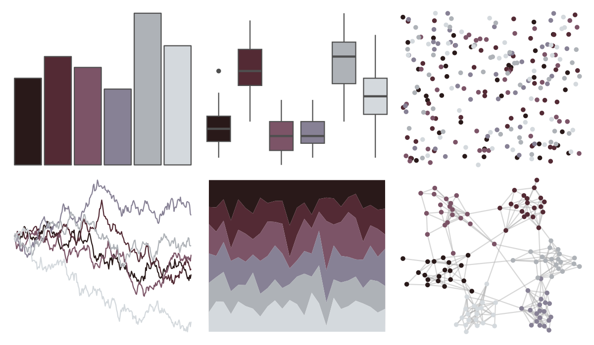

# NatParksPalettes - CapitolReef 

::: columns
::: {.column width="50%"}

**Github**

[kevinsblake/NatParksPalettes](https://github.com/kevinsblake/NatParksPalettes)
:::

::: {.column width="50%"}

**CRAN**

[NatParksPalettes](https://CRAN.R-project.org/package=NatParksPalettes)
:::
:::

<hr> 

Use with [paletteer](https://emilhvitfeldt.github.io/paletteer/) package:

```r
library(paletteer)
paletteer_d("NatParksPalettes::CapitolReef")
```

Use raw:

```r
c("#291919FF", "#532A34FF", "#7C5467FF", "#878195FF", "#AEB2B7FF", "#D4D9DDFF")
``` 

 

<br>

# Related Palettes

<div class="list" style="display: grid; grid-template-columns: auto auto auto;"> <figure class="figure">
<a href="../../amerika/Dem_Ind_Rep3/"> </a>
</figure> <figure class="figure">
<a href="../../tvthemes/Night/"> </a>
</figure> <figure class="figure">
<a href="../../PrettyCols/Greys/"> </a>
</figure> <figure class="figure">
<a href="../../colRoz/kimberley/"> </a>
</figure> <figure class="figure">
<a href="../../tayloRswift/midnights/"> </a>
</figure> <figure class="figure">
<a href="../../beyonce/X122/"> </a>
</figure> <figure class="figure">
<a href="../../Rdune/corrino/"> </a>
</figure> <figure class="figure">
<a href="../../beyonce/X125/"> </a>
</figure> <figure class="figure">
<a href="../../futurevisions/pso/"> </a>
</figure> <figure class="figure">
<a href="../../calecopal/tidepool/"> </a>
</figure> <figure class="figure">
<a href="../../fishualize/Sander_lucioperca/"> </a>
</figure> <figure class="figure">
<a href="../../beyonce/X128/"> </a>
</figure> 
</div>
