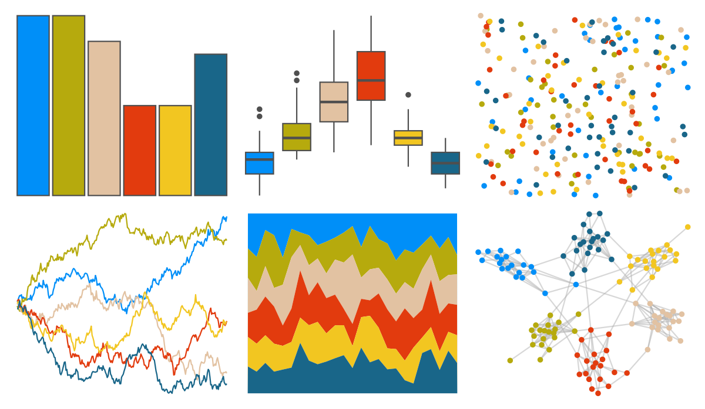

# NatParksPalettes - Chamonix 

::: columns
::: {.column width="50%"}

**Github**

[kevinsblake/NatParksPalettes](https://github.com/kevinsblake/NatParksPalettes)
:::

::: {.column width="50%"}

**CRAN**

[NatParksPalettes](https://CRAN.R-project.org/package=NatParksPalettes)
:::
:::

<hr> 

Use with [paletteer](https://emilhvitfeldt.github.io/paletteer/) package:

```r
library(paletteer)
paletteer_d("NatParksPalettes::Chamonix")
```

Use raw:

```r
c("#008FF8FF", "#B6AA0DFF", "#E2C2A2FF", "#E23B0EFF", "#F2C621FF", "#196689FF")
``` 

 

<br>

# Related Palettes

<div class="list" style="display: grid; grid-template-columns: auto auto auto;"> <figure class="figure">
<a href="../../amerika/Dem_Ind_Rep3/"> </a>
</figure> <figure class="figure">
<a href="../../wesanderson/Rushmore/"> </a>
</figure> <figure class="figure">
<a href="../../wesanderson/Rushmore1/"> </a>
</figure> <figure class="figure">
<a href="../../nbapalettes/bucks_city2/"> </a>
</figure> <figure class="figure">
<a href="../../tvthemes/CrazyLaceAgate/"> </a>
</figure> <figure class="figure">
<a href="../../fishualize/Koumansetta_rainfordi/"> </a>
</figure> <figure class="figure">
<a href="../../yarrr/espresso/"> </a>
</figure> <figure class="figure">
<a href="../../yarrr/southpark/"> </a>
</figure> <figure class="figure">
<a href="../../MetBrewer/Juarez/"> </a>
</figure> <figure class="figure">
<a href="../../fishualize/Pseudocheilinus_tetrataenia/"> </a>
</figure> <figure class="figure">
<a href="../../jcolors/pal9/"> </a>
</figure> <figure class="figure">
<a href="../../NatParksPalettes/Yellowstone/"> </a>
</figure> 
</div>
