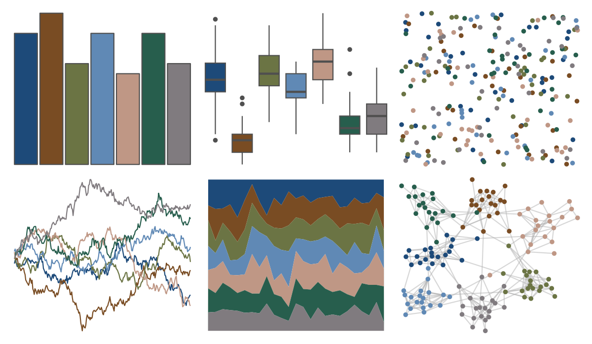
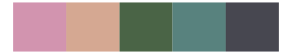

# NatParksPalettes - CraterLake 

::: columns
::: {.column width="50%"}

**Github**

[kevinsblake/NatParksPalettes](https://github.com/kevinsblake/NatParksPalettes)
:::

::: {.column width="50%"}

**CRAN**

[NatParksPalettes](https://CRAN.R-project.org/package=NatParksPalettes)
:::
:::

<hr> 

Use with [paletteer](https://emilhvitfeldt.github.io/paletteer/) package:

```r
library(paletteer)
paletteer_d("NatParksPalettes::CraterLake")
```

Use raw:

```r
c("#1D4A79FF", "#794C23FF", "#6B7444FF", "#6089B5FF", "#BF9785FF", "#275E4DFF", "#807B7FFF")
``` 

 

<br>

# Related Palettes

<div class="list" style="display: grid; grid-template-columns: auto auto auto;"> <figure class="figure">
<a href="../../awtools/a_palette/"> </a>
</figure> <figure class="figure">
<a href="../../NatParksPalettes/GrandCanyon/"> </a>
</figure> <figure class="figure">
<a href="../../fishualize/Oncorhynchus_gorbuscha/"> </a>
</figure> <figure class="figure">
<a href="../../calecopal/halfdome/"> </a>
</figure> <figure class="figure">
<a href="../../colRoz/salt_lake/"> </a>
</figure> <figure class="figure">
<a href="../../calecopal/sierra1/"> </a>
</figure> <figure class="figure">
<a href="../../lisa/GeorgesSeurat/"> </a>
</figure> <figure class="figure">
<a href="../../MetBrewer/Kandinsky/"> </a>
</figure> <figure class="figure">
<a href="../../Manu/Putangitangi/"> </a>
</figure> <figure class="figure">
<a href="../../colRoz/k_tristis/"> </a>
</figure> <figure class="figure">
<a href="../../NatParksPalettes/Torres/"> </a>
</figure> <figure class="figure">
<a href="../../fishualize/Antennarius_commerson/"> </a>
</figure> 
</div>
