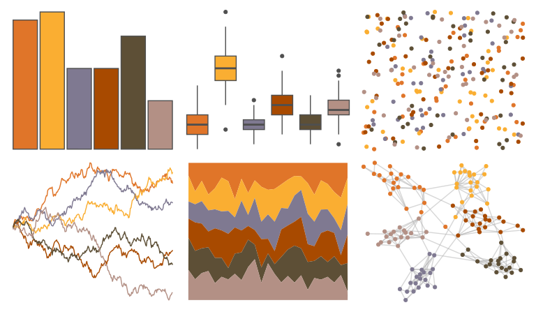

# NatParksPalettes - Cuyahoga 

::: columns
::: {.column width="50%"}

**Github**

[kevinsblake/NatParksPalettes](https://github.com/kevinsblake/NatParksPalettes)
:::

::: {.column width="50%"}

**CRAN**

[NatParksPalettes](https://CRAN.R-project.org/package=NatParksPalettes)
:::
:::

<hr> 

Use with [paletteer](https://emilhvitfeldt.github.io/paletteer/) package:

```r
library(paletteer)
paletteer_d("NatParksPalettes::Cuyahoga")
```

Use raw:

```r
c("#E07529FF", "#FAAE32FF", "#7F7991FF", "#A84A00FF", "#5D4F36FF", "#B39085FF")
``` 

 

<br>

# Related Palettes

<div class="list" style="display: grid; grid-template-columns: auto auto auto;"> <figure class="figure">
<a href="../../awtools/a_palette/"> </a>
</figure> <figure class="figure">
<a href="../../IslamicArt/istanbul3/"> </a>
</figure> <figure class="figure">
<a href="../../NatParksPalettes/BryceCanyon/"> </a>
</figure> <figure class="figure">
<a href="../../calecopal/dudleya/"> </a>
</figure> <figure class="figure">
<a href="../../rtist/raphael/"> </a>
</figure> <figure class="figure">
<a href="../../ggthemes/excel_Red/"> </a>
</figure> <figure class="figure">
<a href="../../severance/Jazz01/"> </a>
</figure> <figure class="figure">
<a href="../../NatParksPalettes/Saguaro/"> </a>
</figure> <figure class="figure">
<a href="../../colRoz/grandis/"> </a>
</figure> <figure class="figure">
<a href="../../rtist/munch/"> </a>
</figure> <figure class="figure">
<a href="../../fishualize/Paranthias_furcifer/"> </a>
</figure> <figure class="figure">
<a href="../../nord/red_mountain/"> </a>
</figure> 
</div>
