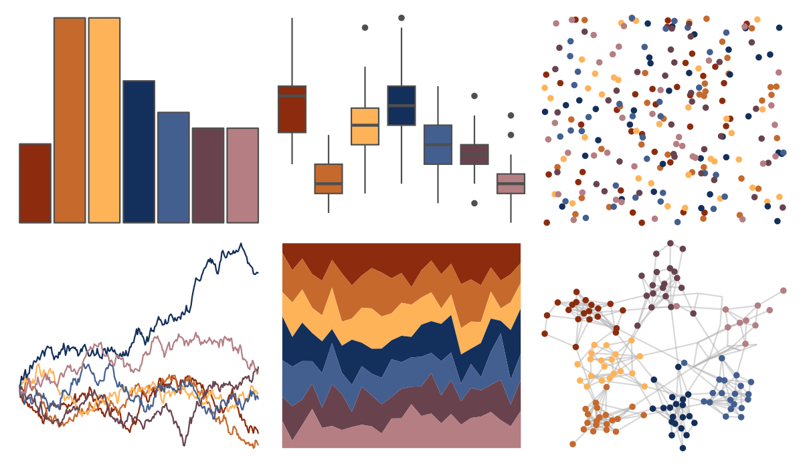

# NatParksPalettes - DeathValley 

::: columns
::: {.column width="50%"}

**Github**

[kevinsblake/NatParksPalettes](https://github.com/kevinsblake/NatParksPalettes)
:::

::: {.column width="50%"}

**CRAN**

[NatParksPalettes](https://CRAN.R-project.org/package=NatParksPalettes)
:::
:::

<hr> 

Use with [paletteer](https://emilhvitfeldt.github.io/paletteer/) package:

```r
library(paletteer)
paletteer_d("NatParksPalettes::DeathValley")
```

Use raw:

```r
c("#8C2B0EFF", "#C5692DFF", "#FEB359FF", "#132F5BFF", "#435F90FF", "#68434EFF", "#B47E83FF")
``` 

 

<br>

# Related Palettes

<div class="list" style="display: grid; grid-template-columns: auto auto auto;"> <figure class="figure">
<a href="../../amerika/Dem_Ind_Rep3/"> </a>
</figure> <figure class="figure">
<a href="../../PNWColors/Sunset2/"> </a>
</figure> <figure class="figure">
<a href="../../fishualize/Paranthias_furcifer/"> </a>
</figure> <figure class="figure">
<a href="../../colRoz/m_horridus/"> </a>
</figure> <figure class="figure">
<a href="../../poisonfrogs/Opsancristobal/"> </a>
</figure> <figure class="figure">
<a href="../../nbapalettes/grizzlies/"> </a>
</figure> <figure class="figure">
<a href="../../lisa/JacobLawrence_1/"> </a>
</figure> <figure class="figure">
<a href="../../nbapalettes/pelicans_city/"> </a>
</figure> <figure class="figure">
<a href="../../MetBrewer/Java/"> </a>
</figure> <figure class="figure">
<a href="../../PrettyCols/Lively/"> </a>
</figure> <figure class="figure">
<a href="../../werpals/when_i_was_your_age/"> </a>
</figure> <figure class="figure">
<a href="../../colRoz/c_brevi/"> </a>
</figure> 
</div>
