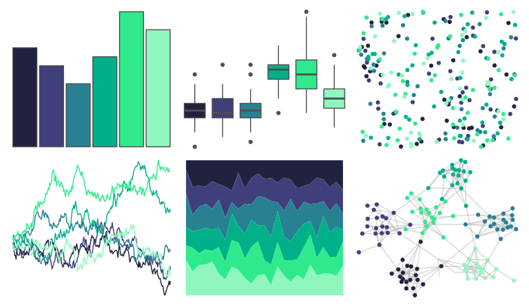

# NatParksPalettes - Denali 

::: columns
::: {.column width="50%"}

**Github**

[kevinsblake/NatParksPalettes](https://github.com/kevinsblake/NatParksPalettes)
:::

::: {.column width="50%"}

**CRAN**

[NatParksPalettes](https://CRAN.R-project.org/package=NatParksPalettes)
:::
:::

<hr> 

Use with [paletteer](https://emilhvitfeldt.github.io/paletteer/) package:

```r
library(paletteer)
paletteer_d("NatParksPalettes::Denali")
```

Use raw:

```r
c("#20223EFF", "#3F3F7BFF", "#278192FF", "#00B089FF", "#2EEA8CFF", "#8FF7BDFF")
``` 

 

<br>

# Related Palettes

<div class="list" style="display: grid; grid-template-columns: auto auto auto;"> <figure class="figure">
<a href="../../awtools/a_palette/"> </a>
</figure> <figure class="figure">
<a href="../../rcartocolor/Emrld/"> </a>
</figure> <figure class="figure">
<a href="../../fishualize/Gomphosus_varius/"> </a>
</figure> <figure class="figure">
<a href="../../RColorBrewer/YlGnBu/"> </a>
</figure> <figure class="figure">
<a href="../../MetBrewer/Hokusai3/"> </a>
</figure> <figure class="figure">
<a href="../../rcartocolor/DarkMint/"> </a>
</figure> <figure class="figure">
<a href="../../LaCroixColoR/Lime/"> </a>
</figure> <figure class="figure">
<a href="../../Redmonder/qMSOBu/"> </a>
</figure> <figure class="figure">
<a href="../../rcartocolor/BluYl/"> </a>
</figure> <figure class="figure">
<a href="../../fishualize/Elagatis_bipinnulata/"> </a>
</figure> <figure class="figure">
<a href="../../NatParksPalettes/Glacier/"> </a>
</figure> <figure class="figure">
<a href="../../MapPalettes/green_machine/"> </a>
</figure> 
</div>
