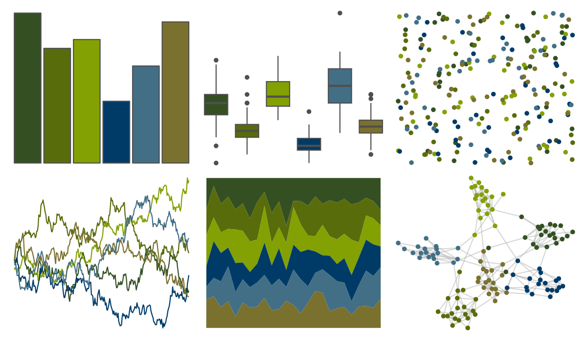

# NatParksPalettes - Everglades 

::: columns
::: {.column width="50%"}

**Github**

[kevinsblake/NatParksPalettes](https://github.com/kevinsblake/NatParksPalettes)
:::

::: {.column width="50%"}

**CRAN**

[NatParksPalettes](https://CRAN.R-project.org/package=NatParksPalettes)
:::
:::

<hr> 

Use with [paletteer](https://emilhvitfeldt.github.io/paletteer/) package:

```r
library(paletteer)
paletteer_d("NatParksPalettes::Everglades")
```

Use raw:

```r
c("#345023FF", "#596C0BFF", "#83A102FF", "#003B68FF", "#426F86FF", "#7A712FFF")
``` 

 

<br>

# Related Palettes

<div class="list" style="display: grid; grid-template-columns: auto auto auto;"> <figure class="figure">
<a href="../../awtools/a_palette/"> </a>
</figure> <figure class="figure">
<a href="../../ButterflyColors/hamadryas_feronia/"> </a>
</figure> <figure class="figure">
<a href="../../ButterflyColors/hamadryas_feronia/"> </a>
</figure> <figure class="figure">
<a href="../../calecopal/kelp2/"> </a>
</figure> <figure class="figure">
<a href="../../fishualize/Balistes_vetula/"> </a>
</figure> <figure class="figure">
<a href="../../PNWColors/Cascades/"> </a>
</figure> <figure class="figure">
<a href="../../vangogh/StarryRhone/"> </a>
</figure> <figure class="figure">
<a href="../../fishualize/Acanthurus_coeruleus/"> </a>
</figure> <figure class="figure">
<a href="../../ggprism/starry/"> </a>
</figure> <figure class="figure">
<a href="../../trekcolors/enara2/"> </a>
</figure> <figure class="figure">
<a href="../../ochRe/lorikeet/"> </a>
</figure> <figure class="figure">
<a href="../../colRoz/virgo/"> </a>
</figure> 
</div>
