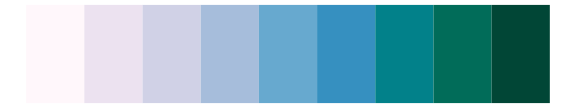

# NatParksPalettes - Glacier 

::: columns
::: {.column width="50%"}

**Github**

[kevinsblake/NatParksPalettes](https://github.com/kevinsblake/NatParksPalettes)
:::

::: {.column width="50%"}

**CRAN**

[NatParksPalettes](https://CRAN.R-project.org/package=NatParksPalettes)
:::
:::

<hr> 

Use with [paletteer](https://emilhvitfeldt.github.io/paletteer/) package:

```r
library(paletteer)
paletteer_d("NatParksPalettes::Glacier")
```

Use raw:

```r
c("#01353DFF", "#088096FF", "#58B3C7FF", "#7AD4E4FF", "#B8FCFCFF")
``` 

 

<br>

# Related Palettes

<div class="list" style="display: grid; grid-template-columns: auto auto auto;"> <figure class="figure">
<a href="../../awtools/a_palette/"> </a>
</figure> <figure class="figure">
<a href="../../LaCroixColoR/Pure/"> </a>
</figure> <figure class="figure">
<a href="../../fishualize/Prionace_glauca/"> </a>
</figure> <figure class="figure">
<a href="../../rockthemes/coltrane/"> </a>
</figure> <figure class="figure">
<a href="../../rcartocolor/DarkMint/"> </a>
</figure> <figure class="figure">
<a href="../../palettetown/pineco/"> </a>
</figure> <figure class="figure">
<a href="../../grDevices/blues9/"> </a>
</figure> <figure class="figure">
<a href="../../RColorBrewer/Blues/"> </a>
</figure> <figure class="figure">
<a href="../../RColorBrewer/GnBu/"> </a>
</figure> <figure class="figure">
<a href="../../RColorBrewer/PuBuGn/"> </a>
</figure> <figure class="figure">
<a href="../../NatParksPalettes/Denali/"> </a>
</figure> <figure class="figure">
<a href="../../ggsci/cyan_material/"> </a>
</figure> 
</div>
