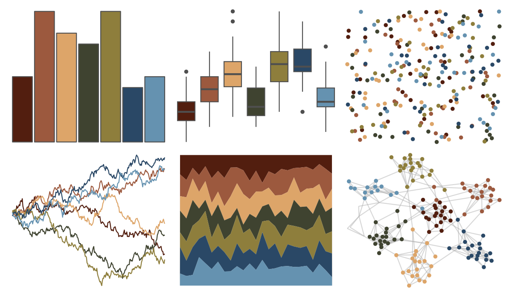

# NatParksPalettes - GrandCanyon 

::: columns
::: {.column width="50%"}

**Github**

[kevinsblake/NatParksPalettes](https://github.com/kevinsblake/NatParksPalettes)
:::

::: {.column width="50%"}

**CRAN**

[NatParksPalettes](https://CRAN.R-project.org/package=NatParksPalettes)
:::
:::

<hr> 

Use with [paletteer](https://emilhvitfeldt.github.io/paletteer/) package:

```r
library(paletteer)
paletteer_d("NatParksPalettes::GrandCanyon")
```

Use raw:

```r
c("#521E0FFF", "#9C593EFF", "#DDA569FF", "#3F4330FF", "#8E7E3CFF", "#2A4866FF", "#6592B0FF")
``` 

 

<br>

# Related Palettes

<div class="list" style="display: grid; grid-template-columns: auto auto auto;"> <figure class="figure">
<a href="../../awtools/a_palette/"> </a>
</figure> <figure class="figure">
<a href="../../ButterflyColors/hamadryas_feronia/"> </a>
</figure> <figure class="figure">
<a href="../../ButterflyColors/hamadryas_feronia/"> </a>
</figure> <figure class="figure">
<a href="../../MetBrewer/Tiepolo/"> </a>
</figure> <figure class="figure">
<a href="../../NatParksPalettes/CraterLake/"> </a>
</figure> <figure class="figure">
<a href="../../NatParksPalettes/Torres/"> </a>
</figure> <figure class="figure">
<a href="../../beyonce/X6/"> </a>
</figure> <figure class="figure">
<a href="../../fishualize/Antennarius_commerson/"> </a>
</figure> <figure class="figure">
<a href="../../lisa/OttoDix/"> </a>
</figure> <figure class="figure">
<a href="../../ggthemes/excel_Aspect/"> </a>
</figure> <figure class="figure">
<a href="../../lisa/EdwardHopper/"> </a>
</figure> <figure class="figure">
<a href="../../lisa/JohannesVermeer/"> </a>
</figure> 
</div>
