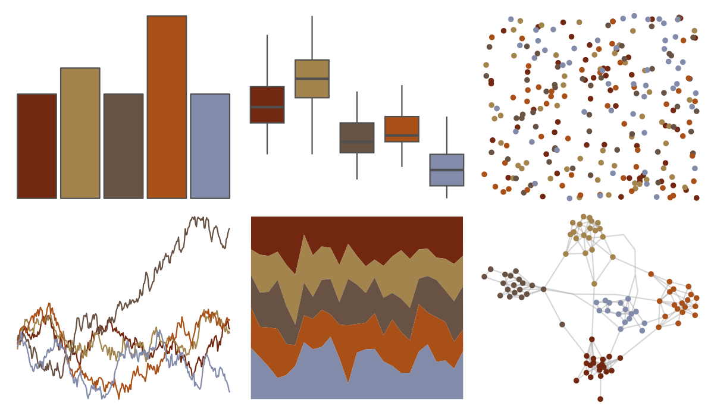

# NatParksPalettes - Halekala 

::: columns
::: {.column width="50%"}

**Github**

[kevinsblake/NatParksPalettes](https://github.com/kevinsblake/NatParksPalettes)
:::

::: {.column width="50%"}

**CRAN**

[NatParksPalettes](https://CRAN.R-project.org/package=NatParksPalettes)
:::
:::

<hr> 

Use with [paletteer](https://emilhvitfeldt.github.io/paletteer/) package:

```r
library(paletteer)
paletteer_d("NatParksPalettes::Halekala")
```

Use raw:

```r
c("#722710FF", "#A3844DFF", "#675243FF", "#A85017FF", "#838BAAFF")
``` 

 

<br>

# Related Palettes

<div class="list" style="display: grid; grid-template-columns: auto auto auto;"> <figure class="figure">
<a href="../../amerika/Dem_Ind_Rep3/"> </a>
</figure> <figure class="figure">
<a href="../../NatParksPalettes/BryceCanyon/"> </a>
</figure> <figure class="figure">
<a href="../../lisa/MaxBeckmann/"> </a>
</figure> <figure class="figure">
<a href="../../lisa/JacobLawrence/"> </a>
</figure> <figure class="figure">
<a href="../../ggthemes/excel_Orange_Red/"> </a>
</figure> <figure class="figure">
<a href="../../ggthemes/excel_Wood_Type/"> </a>
</figure> <figure class="figure">
<a href="../../colRoz/desert_flood/"> </a>
</figure> <figure class="figure">
<a href="../../calecopal/gayophytum/"> </a>
</figure> <figure class="figure">
<a href="../../nbapalettes/pelicans_city/"> </a>
</figure> <figure class="figure">
<a href="../../werpals/when_i_was_your_age/"> </a>
</figure> <figure class="figure">
<a href="../../tvthemes/Targaryen/"> </a>
</figure> <figure class="figure">
<a href="../../fishualize/Epinephelus_striatus/"> </a>
</figure> 
</div>
