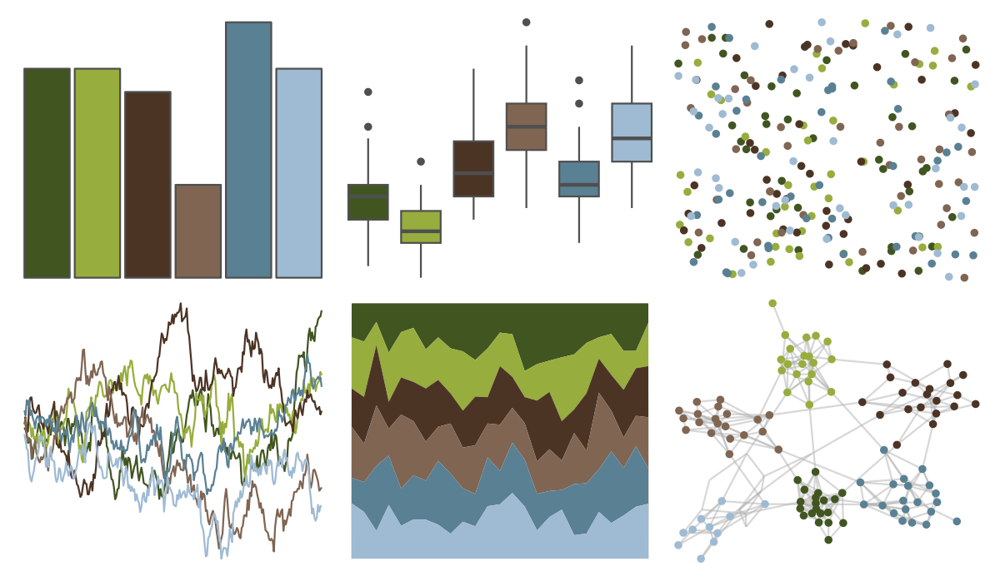

# NatParksPalettes - IguazuFalls 

::: columns
::: {.column width="50%"}

**Github**

[kevinsblake/NatParksPalettes](https://github.com/kevinsblake/NatParksPalettes)
:::

::: {.column width="50%"}

**CRAN**

[NatParksPalettes](https://CRAN.R-project.org/package=NatParksPalettes)
:::
:::

<hr> 

Use with [paletteer](https://emilhvitfeldt.github.io/paletteer/) package:

```r
library(paletteer)
paletteer_d("NatParksPalettes::IguazuFalls")
```

Use raw:

```r
c("#415521FF", "#97AD3DFF", "#4C3425FF", "#7F6552FF", "#5A8093FF", "#9FBAD3FF")
``` 

 

<br>

# Related Palettes

<div class="list" style="display: grid; grid-template-columns: auto auto auto;"> <figure class="figure">
<a href="../../amerika/Dem_Ind_Rep3/"> </a>
</figure> <figure class="figure">
<a href="../../calecopal/bigsur2/"> </a>
</figure> <figure class="figure">
<a href="../../lisa/KarlZerbe/"> </a>
</figure> <figure class="figure">
<a href="../../lisa/Michelangelo/"> </a>
</figure> <figure class="figure">
<a href="../../vapeplot/seapunk/"> </a>
</figure> <figure class="figure">
<a href="../../vapoRwave/seaPunk/"> </a>
</figure> <figure class="figure">
<a href="../../lisa/VincentvanGogh_2/"> </a>
</figure> <figure class="figure">
<a href="../../lisa/ClaudeMonet_2/"> </a>
</figure> <figure class="figure">
<a href="../../lisa/EdwardHopper/"> </a>
</figure> <figure class="figure">
<a href="../../calecopal/halfdome/"> </a>
</figure> <figure class="figure">
<a href="../../colRoz/salt_lake/"> </a>
</figure> <figure class="figure">
<a href="../../vangogh/Irises/"> </a>
</figure> 
</div>
