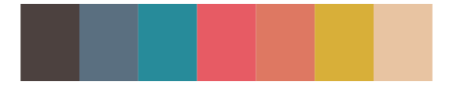

# NatParksPalettes - KingsCanyon 

::: columns
::: {.column width="50%"}

**Github**

[kevinsblake/NatParksPalettes](https://github.com/kevinsblake/NatParksPalettes)
:::

::: {.column width="50%"}

**CRAN**

[NatParksPalettes](https://CRAN.R-project.org/package=NatParksPalettes)
:::
:::

<hr> 

Use with [paletteer](https://emilhvitfeldt.github.io/paletteer/) package:

```r
library(paletteer)
paletteer_d("NatParksPalettes::KingsCanyon")
```

Use raw:

```r
c("#613921FF", "#A77652FF", "#F2C27BFF", "#AAC9EDFF", "#44637DFF", "#8E949FFF")
``` 

 

<br>

# Related Palettes

<div class="list" style="display: grid; grid-template-columns: auto auto auto;"> <figure class="figure">
<a href="../../awtools/a_palette/"> </a>
</figure> <figure class="figure">
<a href="../../Manu/Kotare/"> </a>
</figure> <figure class="figure">
<a href="../../ghibli/PonyoMedium/"> </a>
</figure> <figure class="figure">
<a href="../../nationalparkcolors/ArcticGates/"> </a>
</figure> <figure class="figure">
<a href="../../tayloRswift/taylor1989/"> </a>
</figure> <figure class="figure">
<a href="../../rockthemes/californication/"> </a>
</figure> <figure class="figure">
<a href="../../nationalparkcolors/ChannelIslands/"> </a>
</figure> <figure class="figure">
<a href="../../ochRe/namatjira_div/"> </a>
</figure> <figure class="figure">
<a href="../../ochRe/parliament/"> </a>
</figure> <figure class="figure">
<a href="../../IslamicArt/alhambra/"> </a>
</figure> <figure class="figure">
<a href="../../lisa/JoanMiro/"> </a>
</figure> <figure class="figure">
<a href="../../ochRe/namatjira_qual/"> </a>
</figure> 
</div>
