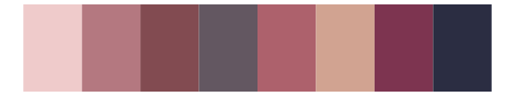

# NatParksPalettes - LakeNakuru 

::: columns
::: {.column width="50%"}

**Github**

[kevinsblake/NatParksPalettes](https://github.com/kevinsblake/NatParksPalettes)
:::

::: {.column width="50%"}

**CRAN**

[NatParksPalettes](https://CRAN.R-project.org/package=NatParksPalettes)
:::
:::

<hr> 

Use with [paletteer](https://emilhvitfeldt.github.io/paletteer/) package:

```r
library(paletteer)
paletteer_d("NatParksPalettes::LakeNakuru")
```

Use raw:

```r
c("#D76E9AFF", "#A1ACC8FF", "#AD3C36FF", "#332627FF", "#EACACFFF", "#AA6B77FF")
``` 

 

<br>

# Related Palettes

<div class="list" style="display: grid; grid-template-columns: auto auto auto;"> <figure class="figure">
<a href="../../awtools/a_palette/"> </a>
</figure> <figure class="figure">
<a href="../../tvthemes/Dusk/"> </a>
</figure> <figure class="figure">
<a href="../../palettetown/gastly/"> </a>
</figure> <figure class="figure">
<a href="../../calecopal/calochortus/"> </a>
</figure> <figure class="figure">
<a href="../../NatParksPalettes/WindCave/"> </a>
</figure> <figure class="figure">
<a href="../../lisa/AndyWarhol_2/"> </a>
</figure> <figure class="figure">
<a href="../../palettetown/forretress/"> </a>
</figure> <figure class="figure">
<a href="../../beyonce/X57/"> </a>
</figure> <figure class="figure">
<a href="../../palettetown/corsola/"> </a>
</figure> <figure class="figure">
<a href="../../ochRe/galah/"> </a>
</figure> <figure class="figure">
<a href="../../fishualize/Lutjanus_sebae/"> </a>
</figure> <figure class="figure">
<a href="../../DresdenColor/ghoststory/"> </a>
</figure> 
</div>
