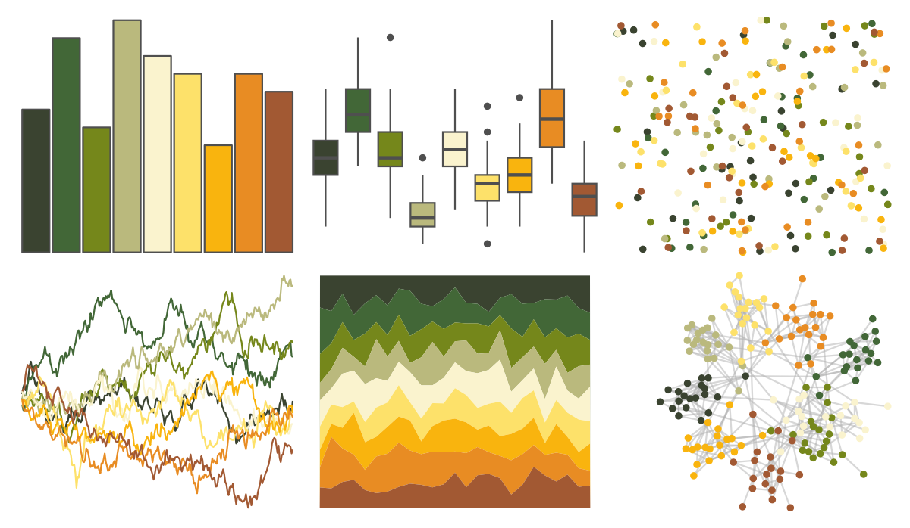

# NatParksPalettes - Olympic 

::: columns
::: {.column width="50%"}

**Github**

[kevinsblake/NatParksPalettes](https://github.com/kevinsblake/NatParksPalettes)
:::

::: {.column width="50%"}

**CRAN**

[NatParksPalettes](https://CRAN.R-project.org/package=NatParksPalettes)
:::
:::

<hr> 

Use with [paletteer](https://emilhvitfeldt.github.io/paletteer/) package:

```r
library(paletteer)
paletteer_d("NatParksPalettes::Olympic")
```

Use raw:

```r
c("#3A4330FF", "#426737FF", "#75871BFF", "#BAB97DFF", "#FAF3CEFF", "#FDE16AFF", "#F9B40EFF", "#E88C23FF", "#A25933FF")
``` 

 

<br>

# Related Palettes

<div class="list" style="display: grid; grid-template-columns: auto auto auto;"> <figure class="figure">
<a href="../../amerika/Dem_Ind_Rep3/"> </a>
</figure> <figure class="figure">
<a href="../../palettetown/drowzee/"> </a>
</figure> <figure class="figure">
<a href="../../palettetown/bellsprout/"> </a>
</figure> <figure class="figure">
<a href="../../PNWColors/Mushroom/"> </a>
</figure> <figure class="figure">
<a href="../../palettetown/seedot/"> </a>
</figure> <figure class="figure">
<a href="../../palettetown/sceptile/"> </a>
</figure> <figure class="figure">
<a href="../../rcartocolor/Fall/"> </a>
</figure> <figure class="figure">
<a href="../../MetBrewer/Homer2/"> </a>
</figure> <figure class="figure">
<a href="../../palettetown/lombre/"> </a>
</figure> <figure class="figure">
<a href="../../palettetown/zapdos/"> </a>
</figure> <figure class="figure">
<a href="../../IslamicArt/fes/"> </a>
</figure> <figure class="figure">
<a href="../../MexBrewer/Ofrenda/"> </a>
</figure> 
</div>
