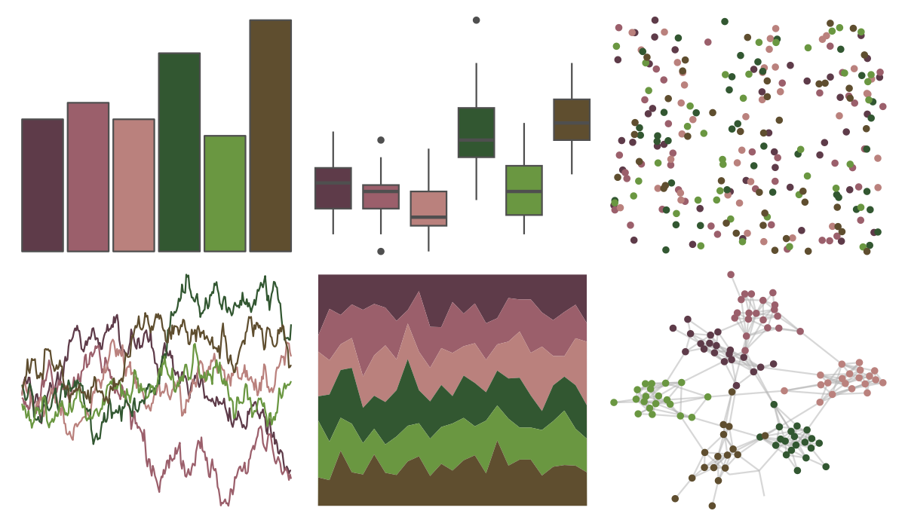

# NatParksPalettes - Redwood 

::: columns
::: {.column width="50%"}

**Github**

[kevinsblake/NatParksPalettes](https://github.com/kevinsblake/NatParksPalettes)
:::

::: {.column width="50%"}

**CRAN**

[NatParksPalettes](https://CRAN.R-project.org/package=NatParksPalettes)
:::
:::

<hr> 

Use with [paletteer](https://emilhvitfeldt.github.io/paletteer/) package:

```r
library(paletteer)
paletteer_d("NatParksPalettes::Redwood")
```

Use raw:

```r
c("#5E3B49FF", "#9B5F6BFF", "#BA817DFF", "#325731FF", "#6A9741FF", "#5F4E2FFF")
``` 

 

<br>

# Related Palettes

<div class="list" style="display: grid; grid-template-columns: auto auto auto;"> <figure class="figure">
<a href="../../awtools/a_palette/"> </a>
</figure> <figure class="figure">
<a href="../../lisa/C_M_Coolidge/"> </a>
</figure> <figure class="figure">
<a href="../../lisa/GeorgesSeurat/"> </a>
</figure> <figure class="figure">
<a href="../../colRoz/v_viatica/"> </a>
</figure> <figure class="figure">
<a href="../../beyonce/X6/"> </a>
</figure> <figure class="figure">
<a href="../../lisa/JohannesVermeer/"> </a>
</figure> <figure class="figure">
<a href="../../colRoz/desert_flood/"> </a>
</figure> <figure class="figure">
<a href="../../lisa/EdouardManet/"> </a>
</figure> <figure class="figure">
<a href="../../lisa/MaxErnst/"> </a>
</figure> <figure class="figure">
<a href="../../lisa/OdilonRedon/"> </a>
</figure> <figure class="figure">
<a href="../../lisa/OttoDix/"> </a>
</figure> <figure class="figure">
<a href="../../colRoz/a_conica/"> </a>
</figure> 
</div>
