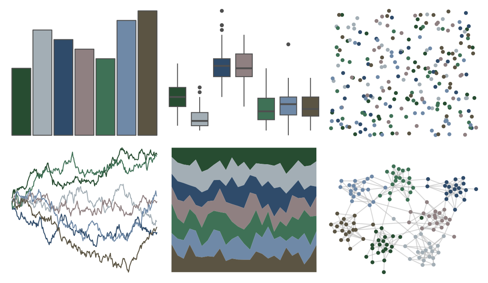

# NatParksPalettes - RockyMtn 

::: columns
::: {.column width="50%"}

**Github**

[kevinsblake/NatParksPalettes](https://github.com/kevinsblake/NatParksPalettes)
:::

::: {.column width="50%"}

**CRAN**

[NatParksPalettes](https://CRAN.R-project.org/package=NatParksPalettes)
:::
:::

<hr> 

Use with [paletteer](https://emilhvitfeldt.github.io/paletteer/) package:

```r
library(paletteer)
paletteer_d("NatParksPalettes::RockyMtn")
```

Use raw:

```r
c("#274C31FF", "#A3AEB5FF", "#2F4B6AFF", "#8F8081FF", "#3F7156FF", "#6F89A7FF", "#5B5443FF")
``` 

 

<br>

# Related Palettes

<div class="list" style="display: grid; grid-template-columns: auto auto auto;"> <figure class="figure">
<a href="../../awtools/a_palette/"> </a>
</figure> <figure class="figure">
<a href="../../ButterflyColors/hamadryas_feronia/"> </a>
</figure> <figure class="figure">
<a href="../../ButterflyColors/hamadryas_feronia/"> </a>
</figure> <figure class="figure">
<a href="../../Manu/Kereru_orig/"> </a>
</figure> <figure class="figure">
<a href="../../Manu/Kereru/"> </a>
</figure> <figure class="figure">
<a href="../../MetBrewer/Pillement/"> </a>
</figure> <figure class="figure">
<a href="../../DresdenColor/deathmasks/"> </a>
</figure> <figure class="figure">
<a href="../../werpals/cinderella/"> </a>
</figure> <figure class="figure">
<a href="../../nord/baie_mouton/"> </a>
</figure> <figure class="figure">
<a href="../../Manu/Korora/"> </a>
</figure> <figure class="figure">
<a href="../../NatParksPalettes/CraterLake/"> </a>
</figure> <figure class="figure">
<a href="../../fishualize/Oncorhynchus_gorbuscha/"> </a>
</figure> 
</div>
