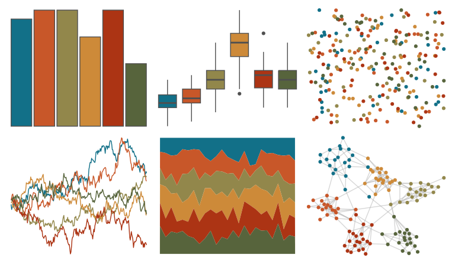

# NatParksPalettes - Saguaro 

::: columns
::: {.column width="50%"}

**Github**

[kevinsblake/NatParksPalettes](https://github.com/kevinsblake/NatParksPalettes)
:::

::: {.column width="50%"}

**CRAN**

[NatParksPalettes](https://CRAN.R-project.org/package=NatParksPalettes)
:::
:::

<hr> 

Use with [paletteer](https://emilhvitfeldt.github.io/paletteer/) package:

```r
library(paletteer)
paletteer_d("NatParksPalettes::Saguaro")
```

Use raw:

```r
c("#127088FF", "#C85729FF", "#92874BFF", "#CD8A39FF", "#AC3414FF", "#57643CFF")
``` 

 

<br>

# Related Palettes

<div class="list" style="display: grid; grid-template-columns: auto auto auto;"> <figure class="figure">
<a href="../../awtools/a_palette/"> </a>
</figure> <figure class="figure">
<a href="../../rtist/munch/"> </a>
</figure> <figure class="figure">
<a href="../../nbapalettes/pelicans_city/"> </a>
</figure> <figure class="figure">
<a href="../../MetBrewer/Tiepolo/"> </a>
</figure> <figure class="figure">
<a href="../../yarrr/rat/"> </a>
</figure> <figure class="figure">
<a href="../../lisa/EdvardMunch_1/"> </a>
</figure> <figure class="figure">
<a href="../../ggthemes/excel_Aspect/"> </a>
</figure> <figure class="figure">
<a href="../../lisa/JacobLawrence/"> </a>
</figure> <figure class="figure">
<a href="../../Redmonder/qMSORd/"> </a>
</figure> <figure class="figure">
<a href="../../NatParksPalettes/Halekala/"> </a>
</figure> <figure class="figure">
<a href="../../NatParksPalettes/Cuyahoga/"> </a>
</figure> <figure class="figure">
<a href="../../NatParksPalettes/BryceCanyon/"> </a>
</figure> 
</div>
