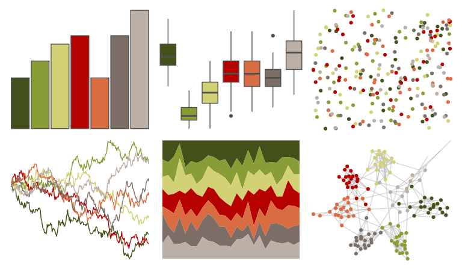

# NatParksPalettes - SmokyMtns 

::: columns
::: {.column width="50%"}

**Github**

[kevinsblake/NatParksPalettes](https://github.com/kevinsblake/NatParksPalettes)
:::

::: {.column width="50%"}

**CRAN**

[NatParksPalettes](https://CRAN.R-project.org/package=NatParksPalettes)
:::
:::

<hr> 

Use with [paletteer](https://emilhvitfeldt.github.io/paletteer/) package:

```r
library(paletteer)
paletteer_d("NatParksPalettes::SmokyMtns")
```

Use raw:

```r
c("#42511AFF", "#889D35FF", "#D3D175FF", "#B50200FF", "#DA6C41FF", "#7C6E66FF", "#BCAFA6FF")
``` 

 

<br>

# Related Palettes

<div class="list" style="display: grid; grid-template-columns: auto auto auto;"> <figure class="figure">
<a href="../../awtools/a_palette/"> </a>
</figure> <figure class="figure">
<a href="../../colRoz/flavolineata/"> </a>
</figure> <figure class="figure">
<a href="../../trekcolors/breen/"> </a>
</figure> <figure class="figure">
<a href="../../colRoz/ngadju/"> </a>
</figure> <figure class="figure">
<a href="../../MetBrewer/Paquin/"> </a>
</figure> <figure class="figure">
<a href="../../IslamicArt/fes/"> </a>
</figure> <figure class="figure">
<a href="../../fishualize/Phractocephalus_hemioliopterus/"> </a>
</figure> <figure class="figure">
<a href="../../soilpalettes/rendoll/"> </a>
</figure> <figure class="figure">
<a href="../../MetBrewer/Homer2/"> </a>
</figure> <figure class="figure">
<a href="../../rcartocolor/Fall/"> </a>
</figure> <figure class="figure">
<a href="../../Redmonder/qMSORd/"> </a>
</figure> <figure class="figure">
<a href="../../lisa/FridaKahlo/"> </a>
</figure> 
</div>
