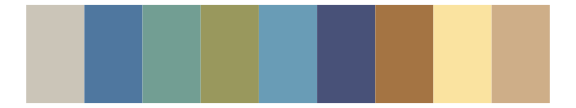

# NatParksPalettes - SouthDowns 

::: columns
::: {.column width="50%"}

**Github**

[kevinsblake/NatParksPalettes](https://github.com/kevinsblake/NatParksPalettes)
:::

::: {.column width="50%"}

**CRAN**

[NatParksPalettes](https://CRAN.R-project.org/package=NatParksPalettes)
:::
:::

<hr> 

Use with [paletteer](https://emilhvitfeldt.github.io/paletteer/) package:

```r
library(paletteer)
paletteer_d("NatParksPalettes::SouthDowns")
```

Use raw:

```r
c("#948D2AFF", "#D5B44DFF", "#89A4BFFF", "#F1D6B6FF", "#9B8358FF", "#577291FF")
``` 

 

<br>

# Related Palettes

<div class="list" style="display: grid; grid-template-columns: auto auto auto;"> <figure class="figure">
<a href="../../amerika/Dem_Ind_Rep3/"> </a>
</figure> <figure class="figure">
<a href="../../nationalparkcolors/MtMckinley/"> </a>
</figure> <figure class="figure">
<a href="../../IslamicArt/jerusalem/"> </a>
</figure> <figure class="figure">
<a href="../../rcartocolor/Earth/"> </a>
</figure> <figure class="figure">
<a href="../../lisa/KarlZerbe/"> </a>
</figure> <figure class="figure">
<a href="../../peRReo/rosalia/"> </a>
</figure> <figure class="figure">
<a href="../../vangogh/Irises/"> </a>
</figure> <figure class="figure">
<a href="../../ggthemes/excel_Feathered/"> </a>
</figure> <figure class="figure">
<a href="../../lisa/MaryCassatt/"> </a>
</figure> <figure class="figure">
<a href="../../ggthemes/excel_Crop/"> </a>
</figure> <figure class="figure">
<a href="../../Manu/Kotare/"> </a>
</figure> <figure class="figure">
<a href="../../vangogh/SelfPortrait/"> </a>
</figure> 
</div>
