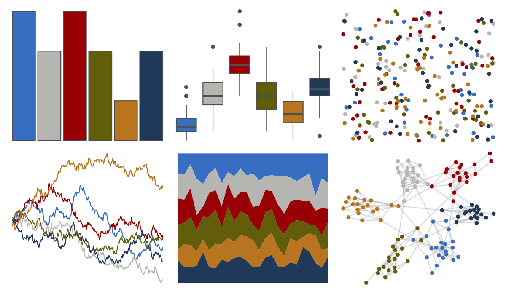

# NatParksPalettes - Triglav 

::: columns
::: {.column width="50%"}

**Github**

[kevinsblake/NatParksPalettes](https://github.com/kevinsblake/NatParksPalettes)
:::

::: {.column width="50%"}

**CRAN**

[NatParksPalettes](https://CRAN.R-project.org/package=NatParksPalettes)
:::
:::

<hr> 

Use with [paletteer](https://emilhvitfeldt.github.io/paletteer/) package:

```r
library(paletteer)
paletteer_d("NatParksPalettes::Triglav")
```

Use raw:

```r
c("#386EC2FF", "#B5B5B2FF", "#990006FF", "#625D0AFF", "#B9741FFF", "#213958FF")
``` 

 

<br>

# Related Palettes

<div class="list" style="display: grid; grid-template-columns: auto auto auto;"> <figure class="figure">
<a href="../../awtools/a_palette/"> </a>
</figure> <figure class="figure">
<a href="../../ButterflyColors/hamadryas_feronia/"> </a>
</figure> <figure class="figure">
<a href="../../ButterflyColors/hamadryas_feronia/"> </a>
</figure> <figure class="figure">
<a href="../../Redmonder/qMSOAsp/"> </a>
</figure> <figure class="figure">
<a href="../../ltc/pantone23/"> </a>
</figure> <figure class="figure">
<a href="../../ltc/minou/"> </a>
</figure> <figure class="figure">
<a href="../../werpals/small_world/"> </a>
</figure> <figure class="figure">
<a href="../../MetBrewer/Juarez/"> </a>
</figure> <figure class="figure">
<a href="../../MetBrewer/Veronese/"> </a>
</figure> <figure class="figure">
<a href="../../nbapalettes/pistons_90s/"> </a>
</figure> <figure class="figure">
<a href="../../PrettyCols/TangerineBlues/"> </a>
</figure> <figure class="figure">
<a href="../../waRhol/skull_77/"> </a>
</figure> 
</div>
