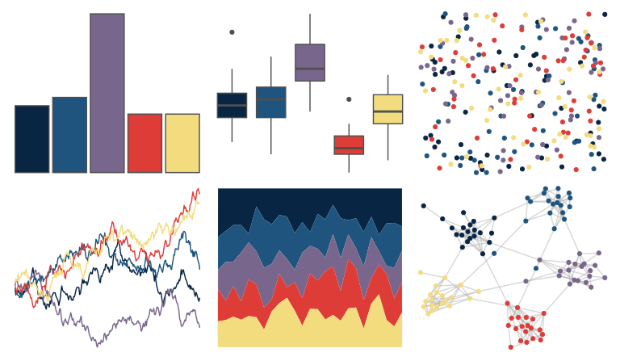

# NatParksPalettes - Volcanoes 

::: columns
::: {.column width="50%"}

**Github**

[kevinsblake/NatParksPalettes](https://github.com/kevinsblake/NatParksPalettes)
:::

::: {.column width="50%"}

**CRAN**

[NatParksPalettes](https://CRAN.R-project.org/package=NatParksPalettes)
:::
:::

<hr> 

Use with [paletteer](https://emilhvitfeldt.github.io/paletteer/) package:

```r
library(paletteer)
paletteer_d("NatParksPalettes::Volcanoes")
```

Use raw:

```r
c("#082544FF", "#1E547DFF", "#79668CFF", "#DE3C37FF", "#F2DC7EFF")
``` 

 

<br>

# Related Palettes

<div class="list" style="display: grid; grid-template-columns: auto auto auto;"> <figure class="figure">
<a href="../../awtools/a_palette/"> </a>
</figure> <figure class="figure">
<a href="../../beyonce/X30/"> </a>
</figure> <figure class="figure">
<a href="../../NineteenEightyR/sunset1/"> </a>
</figure> <figure class="figure">
<a href="../../lisa/EdvardMunch/"> </a>
</figure> <figure class="figure">
<a href="../../DresdenColor/briefcases/"> </a>
</figure> <figure class="figure">
<a href="../../jcolors/pal4/"> </a>
</figure> <figure class="figure">
<a href="../../colRoz/desert_dusk/"> </a>
</figure> <figure class="figure">
<a href="../../lisa/PerArnoldi/"> </a>
</figure> <figure class="figure">
<a href="../../nbapalettes/thunder_city/"> </a>
</figure> <figure class="figure">
<a href="../../MetBrewer/Thomas/"> </a>
</figure> <figure class="figure">
<a href="../../ghibli/MononokeMedium/"> </a>
</figure> <figure class="figure">
<a href="../../nbapalettes/grizzlies_europe/"> </a>
</figure> 
</div>
