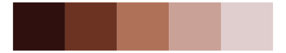
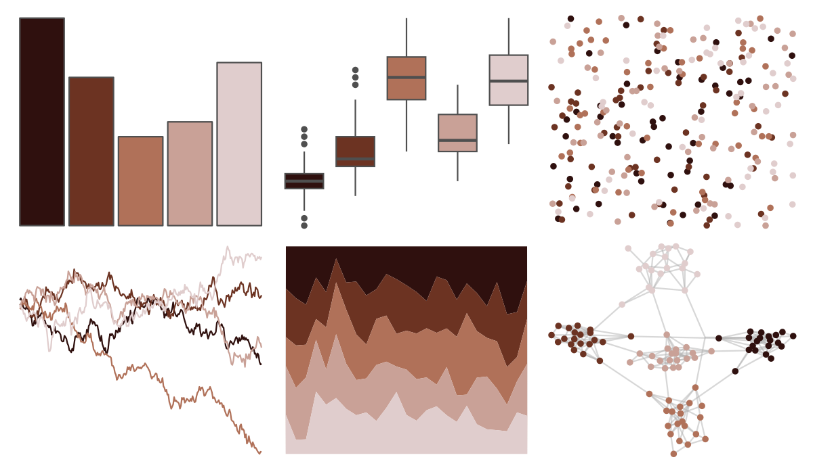

# NatParksPalettes - WindCave 

::: columns
::: {.column width="50%"}

**Github**

[kevinsblake/NatParksPalettes](https://github.com/kevinsblake/NatParksPalettes)
:::

::: {.column width="50%"}

**CRAN**

[NatParksPalettes](https://CRAN.R-project.org/package=NatParksPalettes)
:::
:::

<hr> 

Use with [paletteer](https://emilhvitfeldt.github.io/paletteer/) package:

```r
library(paletteer)
paletteer_d("NatParksPalettes::WindCave")
```

Use raw:

```r
c("#2F100EFF", "#6C3322FF", "#B07159FF", "#C9A197FF", "#E0CDCDFF")
``` 

 

<br>

# Related Palettes

<div class="list" style="display: grid; grid-template-columns: auto auto auto;"> <figure class="figure">
<a href="../../amerika/Dem_Ind_Rep3/"> </a>
</figure> <figure class="figure">
<a href="../../soilpalettes/alaquod/"> </a>
</figure> <figure class="figure">
<a href="../../PrettyCols/Browns/"> </a>
</figure> <figure class="figure">
<a href="../../fishualize/Semicossyphus_pulcher/"> </a>
</figure> <figure class="figure">
<a href="../../wesanderson/IsleofDogs2/"> </a>
</figure> <figure class="figure">
<a href="../../beyonce/X46/"> </a>
</figure> <figure class="figure">
<a href="../../fishualize/Epinephelus_striatus/"> </a>
</figure> <figure class="figure">
<a href="../../beyonce/X24/"> </a>
</figure> <figure class="figure">
<a href="../../tayloRswift/midnightsBloodMoon/"> </a>
</figure> <figure class="figure">
<a href="../../fishualize/Sander_lucioperca/"> </a>
</figure> <figure class="figure">
<a href="../../colRoz/e_kingii/"> </a>
</figure> <figure class="figure">
<a href="../../ButterflyColors/danaus_eresimus/"> </a>
</figure> 
</div>
