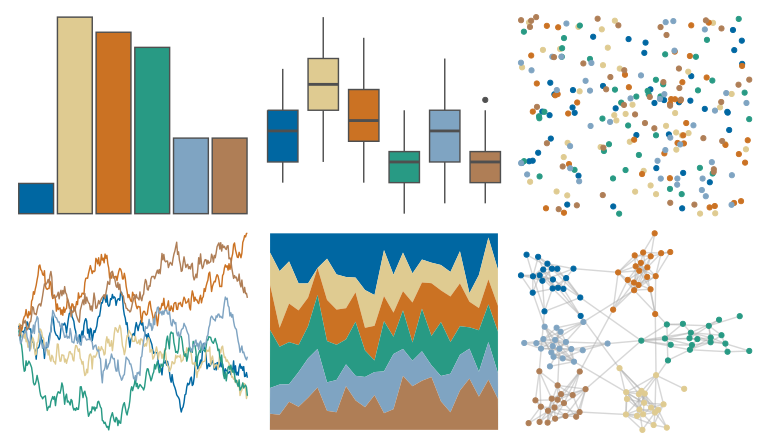

# NatParksPalettes - Yellowstone 

::: columns
::: {.column width="50%"}

**Github**

[kevinsblake/NatParksPalettes](https://github.com/kevinsblake/NatParksPalettes)
:::

::: {.column width="50%"}

**CRAN**

[NatParksPalettes](https://CRAN.R-project.org/package=NatParksPalettes)
:::
:::

<hr> 

Use with [paletteer](https://emilhvitfeldt.github.io/paletteer/) package:

```r
library(paletteer)
paletteer_d("NatParksPalettes::Yellowstone")
```

Use raw:

```r
c("#0067A2FF", "#DFCB91FF", "#CB7223FF", "#289A84FF", "#7FA4C2FF", "#AF7E56FF")
``` 

 

<br>

# Related Palettes

<div class="list" style="display: grid; grid-template-columns: auto auto auto;"> <figure class="figure">
<a href="../../awtools/a_palette/"> </a>
</figure> <figure class="figure">
<a href="../../ggthemes/excel_Headlines/"> </a>
</figure> <figure class="figure">
<a href="../../IslamicArt/jerusalem/"> </a>
</figure> <figure class="figure">
<a href="../../calecopal/figmtn/"> </a>
</figure> <figure class="figure">
<a href="../../MetBrewer/Hiroshige/"> </a>
</figure> <figure class="figure">
<a href="../../ggthemes/Classic_Green_Orange_6/"> </a>
</figure> <figure class="figure">
<a href="../../ochRe/olsen_qual/"> </a>
</figure> <figure class="figure">
<a href="../../MetBrewer/VanGogh2/"> </a>
</figure> <figure class="figure">
<a href="../../colRoz/uluru/"> </a>
</figure> <figure class="figure">
<a href="../../ggsci/light_uchicago/"> </a>
</figure> <figure class="figure">
<a href="../../Redmonder/qMSO15/"> </a>
</figure> <figure class="figure">
<a href="../../lisa/PabloPicasso_1/"> </a>
</figure> 
</div>
