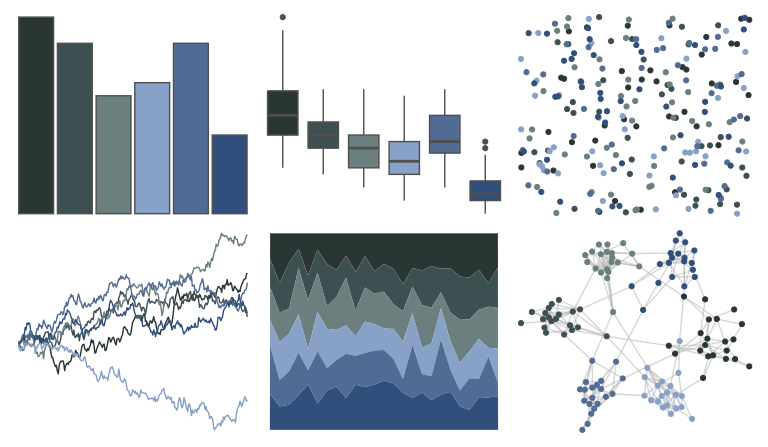

# NatParksPalettes - Yosemite 

::: columns
::: {.column width="50%"}

**Github**

[kevinsblake/NatParksPalettes](https://github.com/kevinsblake/NatParksPalettes)
:::

::: {.column width="50%"}

**CRAN**

[NatParksPalettes](https://CRAN.R-project.org/package=NatParksPalettes)
:::
:::

<hr> 

Use with [paletteer](https://emilhvitfeldt.github.io/paletteer/) package:

```r
library(paletteer)
paletteer_d("NatParksPalettes::Yosemite")
```

Use raw:

```r
c("#293633FF", "#3D5051FF", "#6B7F7FFF", "#87A1C7FF", "#516B95FF", "#304F7DFF")
``` 

 

<br>

# Related Palettes

<div class="list" style="display: grid; grid-template-columns: auto auto auto;"> <figure class="figure">
<a href="../../awtools/a_palette/"> </a>
</figure> <figure class="figure">
<a href="../../musculusColors/ErHead/"> </a>
</figure> <figure class="figure">
<a href="../../unikn/pal_karpfenblau/"> </a>
</figure> <figure class="figure">
<a href="../../Manu/Kereru/"> </a>
</figure> <figure class="figure">
<a href="../../musculusColors/ErMole/"> </a>
</figure> <figure class="figure">
<a href="../../severance/Half/"> </a>
</figure> <figure class="figure">
<a href="../../beyonce/X47/"> </a>
</figure> <figure class="figure">
<a href="../../palettetown/muk/"> </a>
</figure> <figure class="figure">
<a href="../../Manu/Kereru_orig/"> </a>
</figure> <figure class="figure">
<a href="../../NatParksPalettes/RockyMtn/"> </a>
</figure> <figure class="figure">
<a href="../../colRoz/m_cyaneus/"> </a>
</figure> <figure class="figure">
<a href="../../severance/Dinner/"> </a>
</figure> 
</div>
