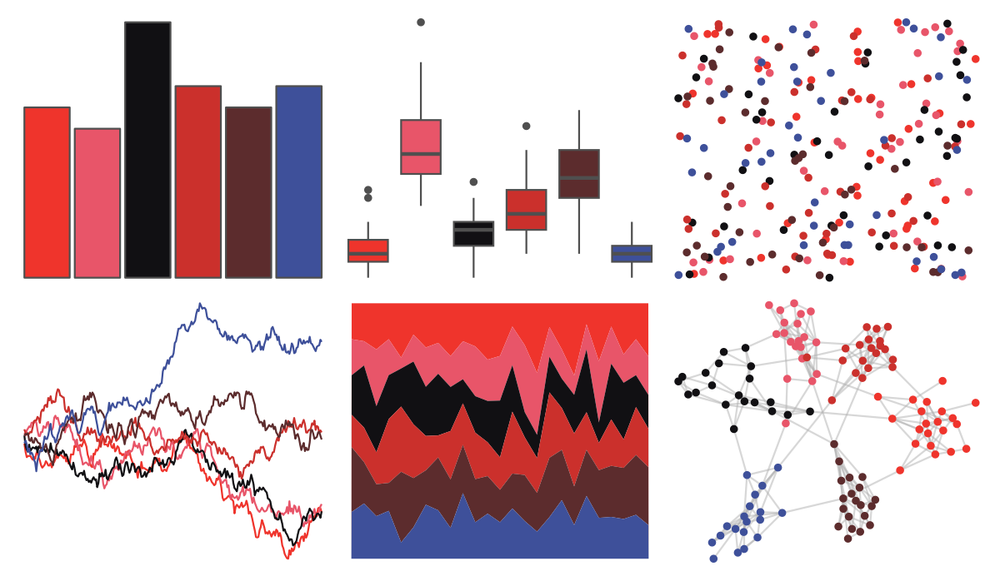

# NineteenEightyR - cobra 

::: columns
::: {.column width="50%"}

**Github**

[m-clark/NineteenEightyR](https://github.com/m-clark/NineteenEightyR)
:::

::: {.column width="50%"}

**CRAN**

Not on CRAN
:::
:::

<hr> 

Use with [paletteer](https://emilhvitfeldt.github.io/paletteer/) package:

```r
library(paletteer)
paletteer_d("NineteenEightyR::cobra")
```

Use raw:

```r
c("#EF342CFF", "#E85569FF", "#111013FF", "#CB302CFF", "#5C2C2DFF", "#3E509AFF")
``` 

 

<br>

# Related Palettes

<div class="list" style="display: grid; grid-template-columns: auto auto auto;"> <figure class="figure">
<a href="../../amerika/Dem_Ind_Rep3/"> </a>
</figure> <figure class="figure">
<a href="../../lisa/PaulKlee_1/"> </a>
</figure> <figure class="figure">
<a href="../../nbapalettes/blazers_city2/"> </a>
</figure> <figure class="figure">
<a href="../../MapPalettes/bruiser/"> </a>
</figure> <figure class="figure">
<a href="../../calecopal/vermillion/"> </a>
</figure> <figure class="figure">
<a href="../../MoMAColors/Althoff/"> </a>
</figure> <figure class="figure">
<a href="../../beyonce/X14/"> </a>
</figure> <figure class="figure">
<a href="../../tayloRswift/speakNowTV/"> </a>
</figure> <figure class="figure">
<a href="../../ButterflyColors/chorinea_licursis/"> </a>
</figure> <figure class="figure">
<a href="../../poisonfrogs/Opbluejeans/"> </a>
</figure> <figure class="figure">
<a href="../../peRReo/ivyqueen/"> </a>
</figure> <figure class="figure">
<a href="../../MoMAColors/Palermo/"> </a>
</figure> 
</div>
