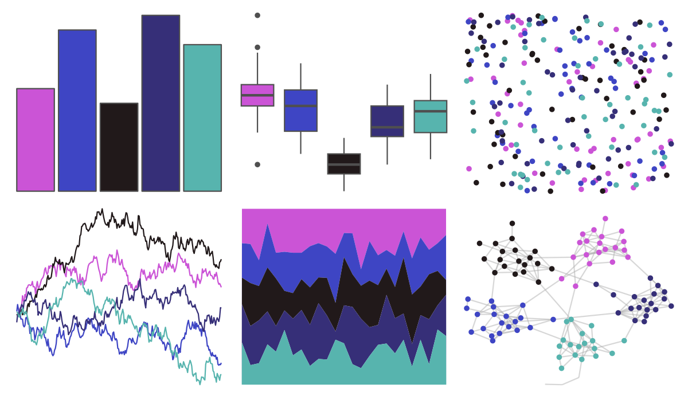

# NineteenEightyR - electronic_night 

::: columns
::: {.column width="50%"}

**Github**

[m-clark/NineteenEightyR](https://github.com/m-clark/NineteenEightyR)
:::

::: {.column width="50%"}

**CRAN**

Not on CRAN
:::
:::

<hr> 

Use with [paletteer](https://emilhvitfeldt.github.io/paletteer/) package:

```r
library(paletteer)
paletteer_d("NineteenEightyR::electronic_night")
```

Use raw:

```r
c("#CB54D6FF", "#3E45C4FF", "#21191AFF", "#362F78FF", "#57B4AEFF")
``` 

 

<br>

# Related Palettes

<div class="list" style="display: grid; grid-template-columns: auto auto auto;"> <figure class="figure">
<a href="../../awtools/a_palette/"> </a>
</figure> <figure class="figure">
<a href="../../colRoz/physalia/"> </a>
</figure> <figure class="figure">
<a href="../../yarrr/eternal/"> </a>
</figure> <figure class="figure">
<a href="../../tvthemes/Flourite/"> </a>
</figure> <figure class="figure">
<a href="../../palettetown/quagsire/"> </a>
</figure> <figure class="figure">
<a href="../../beyonce/X121/"> </a>
</figure> <figure class="figure">
<a href="../../lisa/GeorgiaOKeeffe/"> </a>
</figure> <figure class="figure">
<a href="../../rtist/okeeffe/"> </a>
</figure> <figure class="figure">
<a href="../../beyonce/X21/"> </a>
</figure> <figure class="figure">
<a href="../../futurevisions/jupiter/"> </a>
</figure> <figure class="figure">
<a href="../../Redmonder/qMSORdPu/"> </a>
</figure> <figure class="figure">
<a href="../../severance/Hell/"> </a>
</figure> 
</div>
