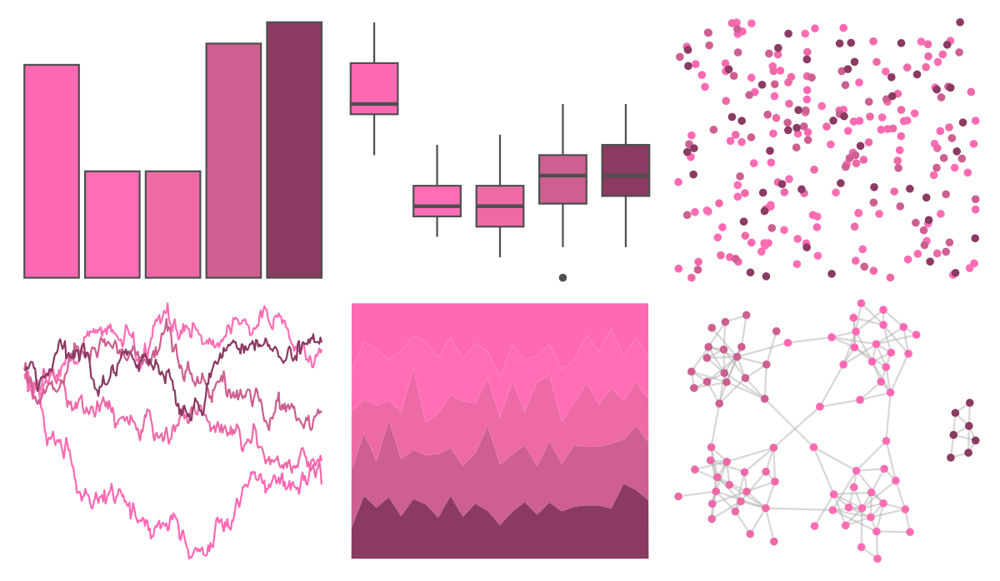

# NineteenEightyR - hotpink 

::: columns
::: {.column width="50%"}

**Github**

[m-clark/NineteenEightyR](https://github.com/m-clark/NineteenEightyR)
:::

::: {.column width="50%"}

**CRAN**

Not on CRAN
:::
:::

<hr> 

Use with [paletteer](https://emilhvitfeldt.github.io/paletteer/) package:

```r
library(paletteer)
paletteer_d("NineteenEightyR::hotpink")
```

Use raw:

```r
c("#FF69B4FF", "#FF6EB4FF", "#EE6AA7FF", "#CD6090FF", "#8B3A62FF")
``` 

 

<br>

# Related Palettes

<div class="list" style="display: grid; grid-template-columns: auto auto auto;"> <figure class="figure">
<a href="../../awtools/a_palette/"> </a>
</figure> <figure class="figure">
<a href="../../ButterflyColors/hamadryas_feronia/"> </a>
</figure> <figure class="figure">
<a href="../../ButterflyColors/hamadryas_feronia/"> </a>
</figure> <figure class="figure">
<a href="../../PrettyCols/Pinks/"> </a>
</figure> <figure class="figure">
<a href="../../vapeplot/sunset/"> </a>
</figure> <figure class="figure">
<a href="../../vapoRwave/sunSet/"> </a>
</figure> <figure class="figure">
<a href="../../unikn/pal_bordeaux/"> </a>
</figure> <figure class="figure">
<a href="../../ggprism/purple_passion/"> </a>
</figure> <figure class="figure">
<a href="../../beyonce/X91/"> </a>
</figure> <figure class="figure">
<a href="../../unikn/pal_pinky/"> </a>
</figure> <figure class="figure">
<a href="../../rcartocolor/Magenta/"> </a>
</figure> <figure class="figure">
<a href="../../rcartocolor/Burg/"> </a>
</figure> 
</div>
