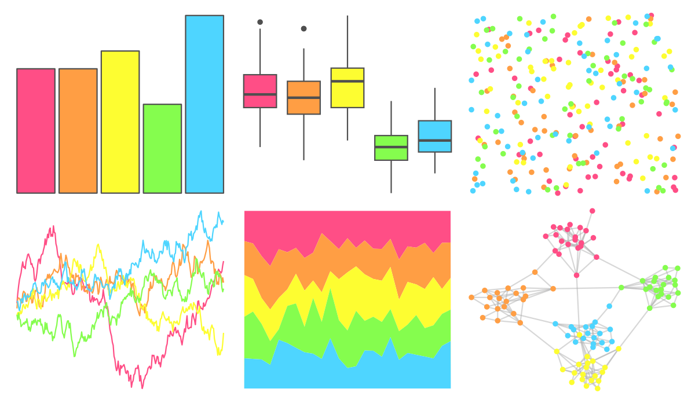

# NineteenEightyR - malibu 

::: columns
::: {.column width="50%"}

**Github**

[m-clark/NineteenEightyR](https://github.com/m-clark/NineteenEightyR)
:::

::: {.column width="50%"}

**CRAN**

Not on CRAN
:::
:::

<hr> 

Use with [paletteer](https://emilhvitfeldt.github.io/paletteer/) package:

```r
library(paletteer)
paletteer_d("NineteenEightyR::malibu")
```

Use raw:

```r
c("#FF4E86FF", "#FF9E44FF", "#FDFD31FF", "#85FD4EFF", "#4ED5FFFF")
``` 

 

<br>

# Related Palettes

<div class="list" style="display: grid; grid-template-columns: auto auto auto;"> <figure class="figure">
<a href="../../amerika/Dem_Ind_Rep3/"> </a>
</figure> <figure class="figure">
<a href="../../RSkittleBrewer/tropical/"> </a>
</figure> <figure class="figure">
<a href="../../fishualize/Sparisoma_viride/"> </a>
</figure> <figure class="figure">
<a href="../../PrettyCols/Neon/"> </a>
</figure> <figure class="figure">
<a href="../../fishualize/Scarus_hoefleri/"> </a>
</figure> <figure class="figure">
<a href="../../ggthemes/excel_Vapor_Trail/"> </a>
</figure> <figure class="figure">
<a href="../../waRhol/skull_86/"> </a>
</figure> <figure class="figure">
<a href="../../fishualize/Minilabrus_striatus/"> </a>
</figure> <figure class="figure">
<a href="../../fishualize/Cirrhilabrus_solorensis/"> </a>
</figure> <figure class="figure">
<a href="../../colorBlindness/Blue2Orange8Steps/"> </a>
</figure> <figure class="figure">
<a href="../../lisa/BillyApple/"> </a>
</figure> <figure class="figure">
<a href="../../dichromat/BluetoOrange_8/"> </a>
</figure> 
</div>
