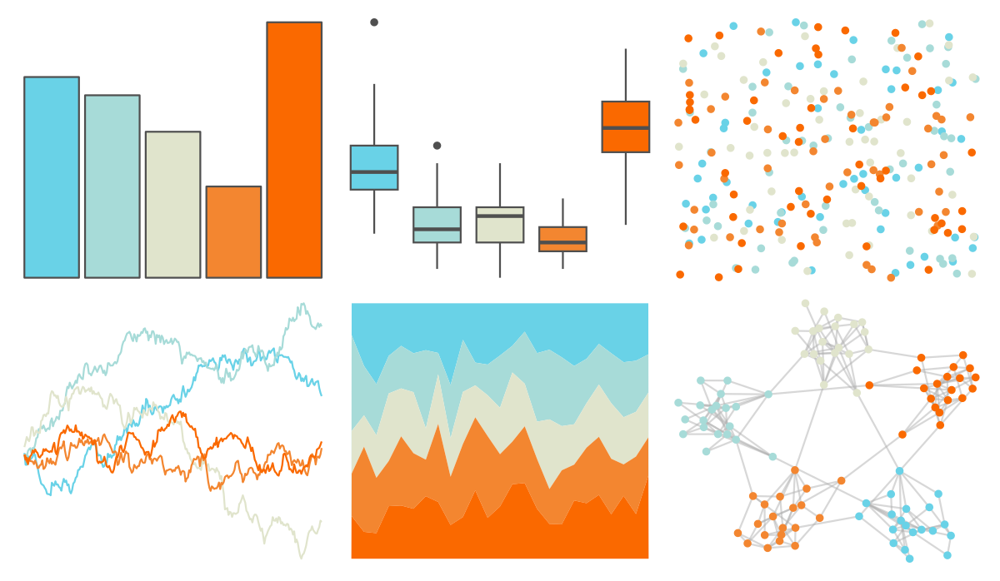

# NineteenEightyR - miami1 

::: columns
::: {.column width="50%"}

**Github**

[m-clark/NineteenEightyR](https://github.com/m-clark/NineteenEightyR)
:::

::: {.column width="50%"}

**CRAN**

Not on CRAN
:::
:::

<hr> 

Use with [paletteer](https://emilhvitfeldt.github.io/paletteer/) package:

```r
library(paletteer)
paletteer_d("NineteenEightyR::miami1")
```

Use raw:

```r
c("#69D2E7FF", "#A7DBD8FF", "#E0E4CCFF", "#F38630FF", "#FA6900FF")
``` 

 

<br>

# Related Palettes

<div class="list" style="display: grid; grid-template-columns: auto auto auto;"> <figure class="figure">
<a href="../../awtools/a_palette/"> </a>
</figure> <figure class="figure">
<a href="../../lisa/JackBush_1/"> </a>
</figure> <figure class="figure">
<a href="../../rcartocolor/Geyser/"> </a>
</figure> <figure class="figure">
<a href="../../MapPalettes/sunset/"> </a>
</figure> <figure class="figure">
<a href="../../beyonce/X28/"> </a>
</figure> <figure class="figure">
<a href="../../nbapalettes/spurs/"> </a>
</figure> <figure class="figure">
<a href="../../wesanderson/Royal2/"> </a>
</figure> <figure class="figure">
<a href="../../ggthemes/Jewel_Bright/"> </a>
</figure> <figure class="figure">
<a href="../../fishualize/Lutjanus_jocu/"> </a>
</figure> <figure class="figure">
<a href="../../wesanderson/Moonrise3/"> </a>
</figure> <figure class="figure">
<a href="../../nationalparkcolors/BryceCanyon/"> </a>
</figure> <figure class="figure">
<a href="../../fishualize/Cantherhines_macrocerus/"> </a>
</figure> 
</div>
