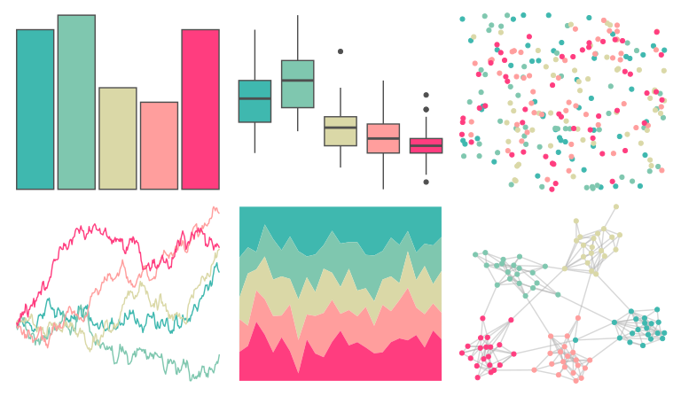

# NineteenEightyR - miami2 

::: columns
::: {.column width="50%"}

**Github**

[m-clark/NineteenEightyR](https://github.com/m-clark/NineteenEightyR)
:::

::: {.column width="50%"}

**CRAN**

Not on CRAN
:::
:::

<hr> 

Use with [paletteer](https://emilhvitfeldt.github.io/paletteer/) package:

```r
library(paletteer)
paletteer_d("NineteenEightyR::miami2")
```

Use raw:

```r
c("#3FB8AFFF", "#7FC7AFFF", "#DAD8A7FF", "#FF9E9DFF", "#FF3D7FFF")
``` 

 

<br>

# Related Palettes

<div class="list" style="display: grid; grid-template-columns: auto auto auto;"> <figure class="figure">
<a href="../../awtools/a_palette/"> </a>
</figure> <figure class="figure">
<a href="../../NineteenEightyR/sonny/"> </a>
</figure> <figure class="figure">
<a href="../../rcartocolor/TealRose/"> </a>
</figure> <figure class="figure">
<a href="../../rcartocolor/Temps/"> </a>
</figure> <figure class="figure">
<a href="../../beyonce/X129/"> </a>
</figure> <figure class="figure">
<a href="../../PNWColors/Sailboat/"> </a>
</figure> <figure class="figure">
<a href="../../nationalparkcolors/Zion/"> </a>
</figure> <figure class="figure">
<a href="../../ggthemes/Jewel_Bright/"> </a>
</figure> <figure class="figure">
<a href="../../rcartocolor/ArmyRose/"> </a>
</figure> <figure class="figure">
<a href="../../lisa/JackBush_1/"> </a>
</figure> <figure class="figure">
<a href="../../ggthemes/Summer/"> </a>
</figure> <figure class="figure">
<a href="../../ggthemes/excel_Berlin/"> </a>
</figure> 
</div>
