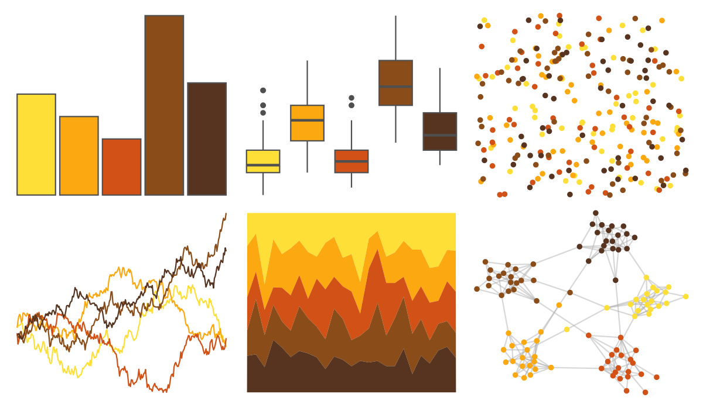

# NineteenEightyR - seventies_aint_done_yet 

::: columns
::: {.column width="50%"}

**Github**

[m-clark/NineteenEightyR](https://github.com/m-clark/NineteenEightyR)
:::

::: {.column width="50%"}

**CRAN**

Not on CRAN
:::
:::

<hr> 

Use with [paletteer](https://emilhvitfeldt.github.io/paletteer/) package:

```r
library(paletteer)
paletteer_d("NineteenEightyR::seventies_aint_done_yet")
```

Use raw:

```r
c("#FEDF37FF", "#FCA811FF", "#D25117FF", "#8A4C19FF", "#573420FF")
``` 

 

<br>

# Related Palettes

<div class="list" style="display: grid; grid-template-columns: auto auto auto;"> <figure class="figure">
<a href="../../awtools/a_palette/"> </a>
</figure> <figure class="figure">
<a href="../../ButterflyColors/hamadryas_feronia/"> </a>
</figure> <figure class="figure">
<a href="../../ButterflyColors/hamadryas_feronia/"> </a>
</figure> <figure class="figure">
<a href="../../fishualize/Hexagrammos_lagocephalus/"> </a>
</figure> <figure class="figure">
<a href="../../fishualize/Dermatolepis_inermis/"> </a>
</figure> <figure class="figure">
<a href="../../MetBrewer/Homer2/"> </a>
</figure> <figure class="figure">
<a href="../../colRoz/a_westwoodi/"> </a>
</figure> <figure class="figure">
<a href="../../palettetown/swinub/"> </a>
</figure> <figure class="figure">
<a href="../../MetBrewer/Greek/"> </a>
</figure> <figure class="figure">
<a href="../../fishualize/Hippocampus_reidi/"> </a>
</figure> <figure class="figure">
<a href="../../colRoz/v_acanthurus/"> </a>
</figure> <figure class="figure">
<a href="../../MexBrewer/Taurus1/"> </a>
</figure> 
</div>
