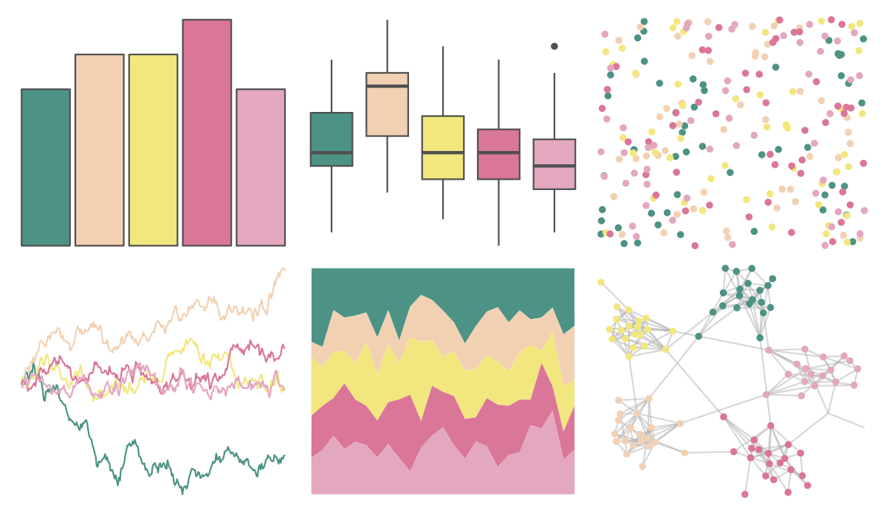

# NineteenEightyR - sonny 

::: columns
::: {.column width="50%"}

**Github**

[m-clark/NineteenEightyR](https://github.com/m-clark/NineteenEightyR)
:::

::: {.column width="50%"}

**CRAN**

Not on CRAN
:::
:::

<hr> 

Use with [paletteer](https://emilhvitfeldt.github.io/paletteer/) package:

```r
library(paletteer)
paletteer_d("NineteenEightyR::sonny")
```

Use raw:

```r
c("#4C9385FF", "#F2D1B3FF", "#F2E77EFF", "#DA7698FF", "#E3A7C0FF")
``` 

 

<br>

# Related Palettes

<div class="list" style="display: grid; grid-template-columns: auto auto auto;"> <figure class="figure">
<a href="../../awtools/a_palette/"> </a>
</figure> <figure class="figure">
<a href="../../ButterflyColors/hamadryas_feronia/"> </a>
</figure> <figure class="figure">
<a href="../../ButterflyColors/hamadryas_feronia/"> </a>
</figure> <figure class="figure">
<a href="../../NineteenEightyR/miami2/"> </a>
</figure> <figure class="figure">
<a href="../../rcartocolor/ArmyRose/"> </a>
</figure> <figure class="figure">
<a href="../../ggthemes/excel_Paper/"> </a>
</figure> <figure class="figure">
<a href="../../rcartocolor/TealRose/"> </a>
</figure> <figure class="figure">
<a href="../../PNWColors/Sailboat/"> </a>
</figure> <figure class="figure">
<a href="../../nord/aurora/"> </a>
</figure> <figure class="figure">
<a href="../../ltc/gaby/"> </a>
</figure> <figure class="figure">
<a href="../../lisa/RobertDelaunay_1/"> </a>
</figure> <figure class="figure">
<a href="../../rcartocolor/Temps/"> </a>
</figure> 
</div>
