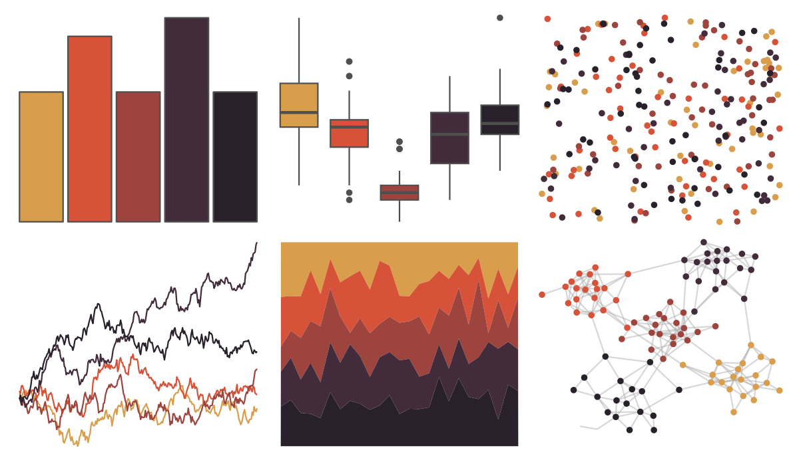
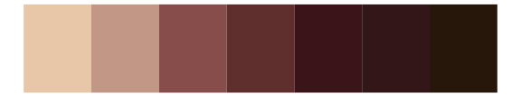

# NineteenEightyR - sunset2 

::: columns
::: {.column width="50%"}

**Github**

[m-clark/NineteenEightyR](https://github.com/m-clark/NineteenEightyR)
:::

::: {.column width="50%"}

**CRAN**

Not on CRAN
:::
:::

<hr> 

Use with [paletteer](https://emilhvitfeldt.github.io/paletteer/) package:

```r
library(paletteer)
paletteer_d("NineteenEightyR::sunset2")
```

Use raw:

```r
c("#D99E4CFF", "#D65238FF", "#9E443FFF", "#422B3AFF", "#28212BFF")
``` 

 

<br>

# Related Palettes

<div class="list" style="display: grid; grid-template-columns: auto auto auto;"> <figure class="figure">
<a href="../../amerika/Dem_Ind_Rep3/"> </a>
</figure> <figure class="figure">
<a href="../../MoMAColors/Alkalay1/"> </a>
</figure> <figure class="figure">
<a href="../../lisa/MaxBeckmann/"> </a>
</figure> <figure class="figure">
<a href="../../fishualize/Labrisomus_cricota/"> </a>
</figure> <figure class="figure">
<a href="../../lisa/AmedeoModigliani/"> </a>
</figure> <figure class="figure">
<a href="../../poisonfrogs/Opsancristobal/"> </a>
</figure> <figure class="figure">
<a href="../../MexBrewer/Aurora/"> </a>
</figure> <figure class="figure">
<a href="../../ButterflyColors/battus_polydamas/"> </a>
</figure> <figure class="figure">
<a href="../../nord/lake_superior/"> </a>
</figure> <figure class="figure">
<a href="../../NatParksPalettes/BryceCanyon/"> </a>
</figure> <figure class="figure">
<a href="../../ButterflyColors/catagramma_pygas/"> </a>
</figure> <figure class="figure">
<a href="../../fishualize/Epinephelus_striatus/"> </a>
</figure> 
</div>
