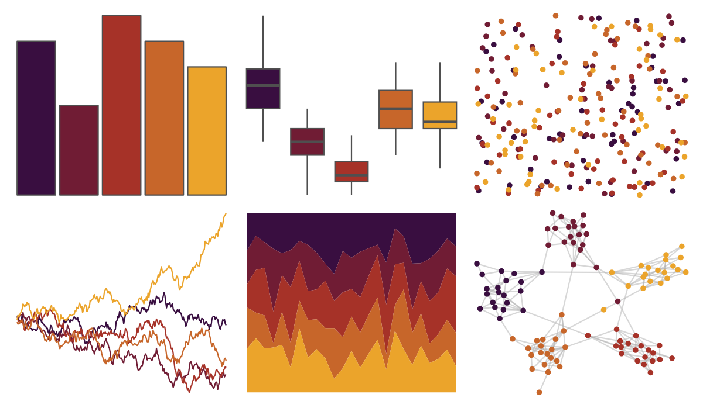

# NineteenEightyR - sunset3 

::: columns
::: {.column width="50%"}

**Github**

[m-clark/NineteenEightyR](https://github.com/m-clark/NineteenEightyR)
:::

::: {.column width="50%"}

**CRAN**

Not on CRAN
:::
:::

<hr> 

Use with [paletteer](https://emilhvitfeldt.github.io/paletteer/) package:

```r
library(paletteer)
paletteer_d("NineteenEightyR::sunset3")
```

Use raw:

```r
c("#390E40FF", "#701C34FF", "#A63228FF", "#C7662AFF", "#EBA42BFF")
``` 

 

<br>

# Related Palettes

<div class="list" style="display: grid; grid-template-columns: auto auto auto;"> <figure class="figure">
<a href="../../awtools/a_palette/"> </a>
</figure> <figure class="figure">
<a href="../../nord/victory_bonds/"> </a>
</figure> <figure class="figure">
<a href="../../rockthemes/alice/"> </a>
</figure> <figure class="figure">
<a href="../../lisa/GretchenAlbrecht/"> </a>
</figure> <figure class="figure">
<a href="../../nbapalettes/blazers_city/"> </a>
</figure> <figure class="figure">
<a href="../../soilpalettes/eutrostox/"> </a>
</figure> <figure class="figure">
<a href="../../nbapalettes/supersonics_90s/"> </a>
</figure> <figure class="figure">
<a href="../../NineteenEightyR/sunset2/"> </a>
</figure> <figure class="figure">
<a href="../../suffrager/london/"> </a>
</figure> <figure class="figure">
<a href="../../colRoz/m_horridus/"> </a>
</figure> <figure class="figure">
<a href="../../NatParksPalettes/DeathValley/"> </a>
</figure> <figure class="figure">
<a href="../../MetBrewer/Tam/"> </a>
</figure> 
</div>
