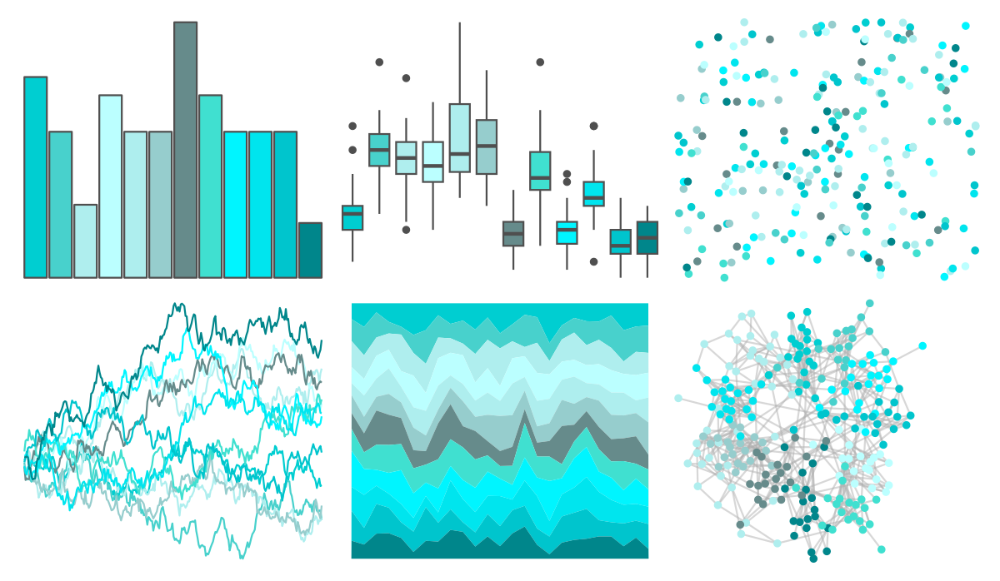
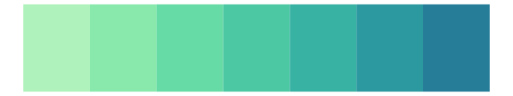

# NineteenEightyR - youngturqs 

::: columns
::: {.column width="50%"}

**Github**

[m-clark/NineteenEightyR](https://github.com/m-clark/NineteenEightyR)
:::

::: {.column width="50%"}

**CRAN**

Not on CRAN
:::
:::

<hr> 

Use with [paletteer](https://emilhvitfeldt.github.io/paletteer/) package:

```r
library(paletteer)
paletteer_d("NineteenEightyR::youngturqs")
```

Use raw:

```r
c("#00CED1FF", "#48D1CCFF", "#AFEEEEFF", "#BBFFFFFF", "#AEEEEEFF", "#96CDCDFF", "#668B8BFF", "#40E0D0FF", "#00F5FFFF", "#00E5EEFF", "#00C5CDFF", "#00868BFF")
``` 

 

<br>

# Related Palettes

<div class="list" style="display: grid; grid-template-columns: auto auto auto;"> <figure class="figure">
<a href="../../awtools/a_palette/"> </a>
</figure> <figure class="figure">
<a href="../../miscpalettes/seaGreen/"> </a>
</figure> <figure class="figure">
<a href="../../colorBlindness/LightBlue2DarkBlue7Steps/"> </a>
</figure> <figure class="figure">
<a href="../../dichromat/LightBluetoDarkBlue_7/"> </a>
</figure> <figure class="figure">
<a href="../../ggsci/cyan_material/"> </a>
</figure> <figure class="figure">
<a href="../../ggsci/teal_material/"> </a>
</figure> <figure class="figure">
<a href="../../Redmonder/sPBIGn/"> </a>
</figure> <figure class="figure">
<a href="../../unikn/pal_seegruen/"> </a>
</figure> <figure class="figure">
<a href="../../musculusColors/Bmlunge/"> </a>
</figure> <figure class="figure">
<a href="../../rcartocolor/TealGrn/"> </a>
</figure> <figure class="figure">
<a href="../../Redmonder/qMSOBu2/"> </a>
</figure> <figure class="figure">
<a href="../../rcartocolor/Mint/"> </a>
</figure> 
</div>
